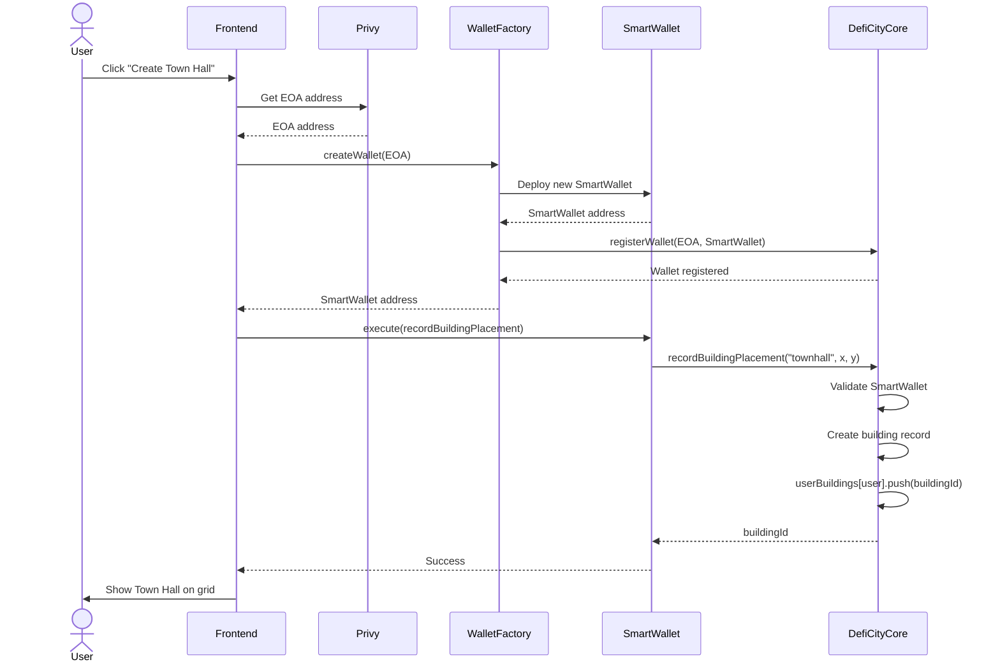
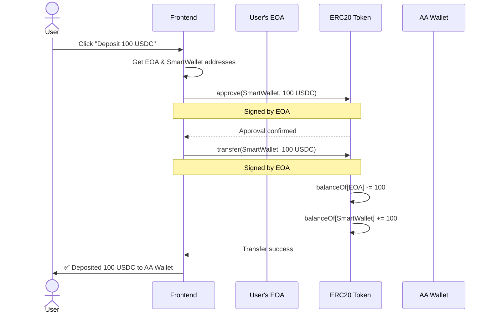
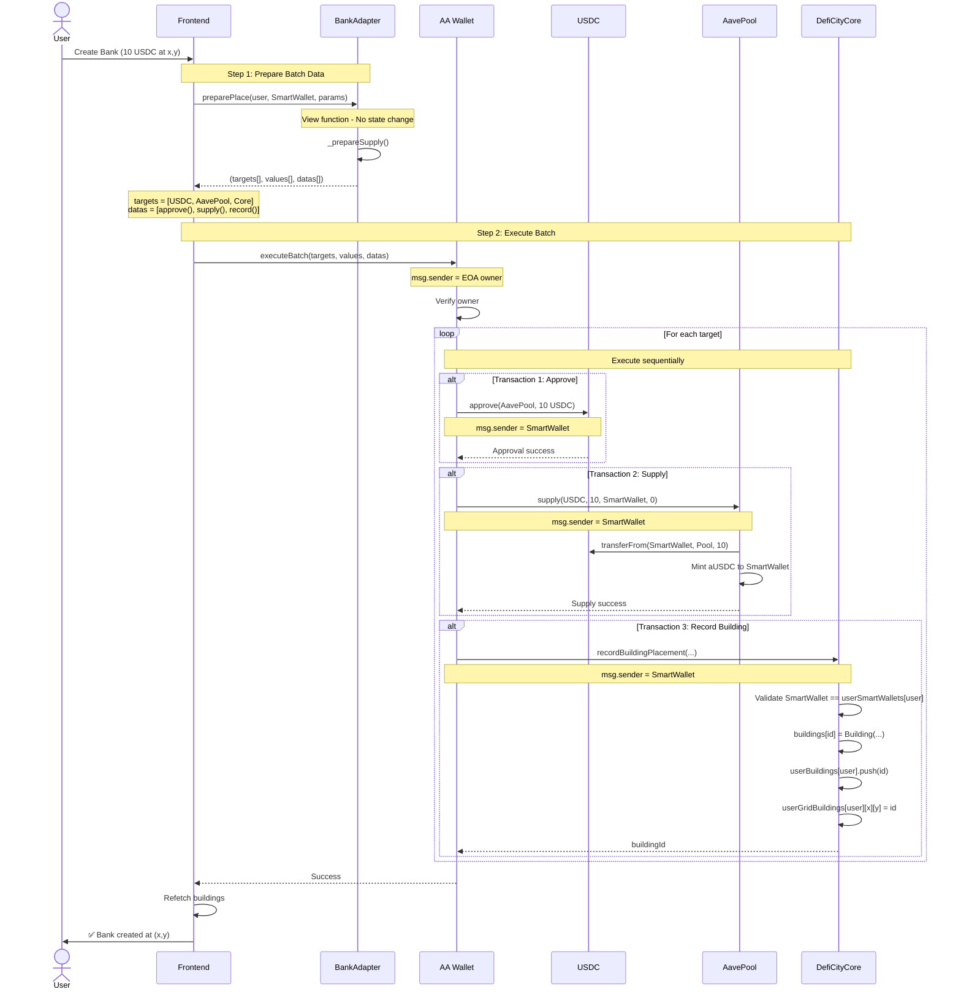
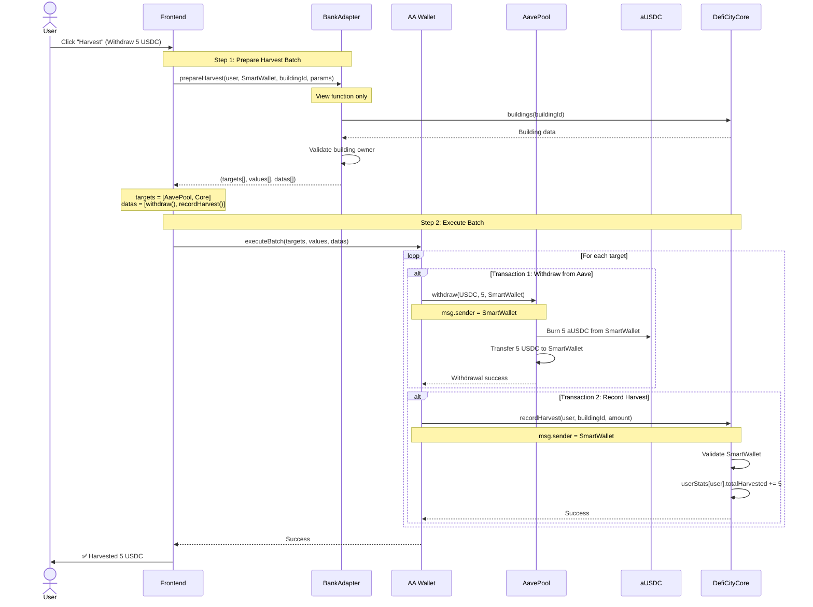
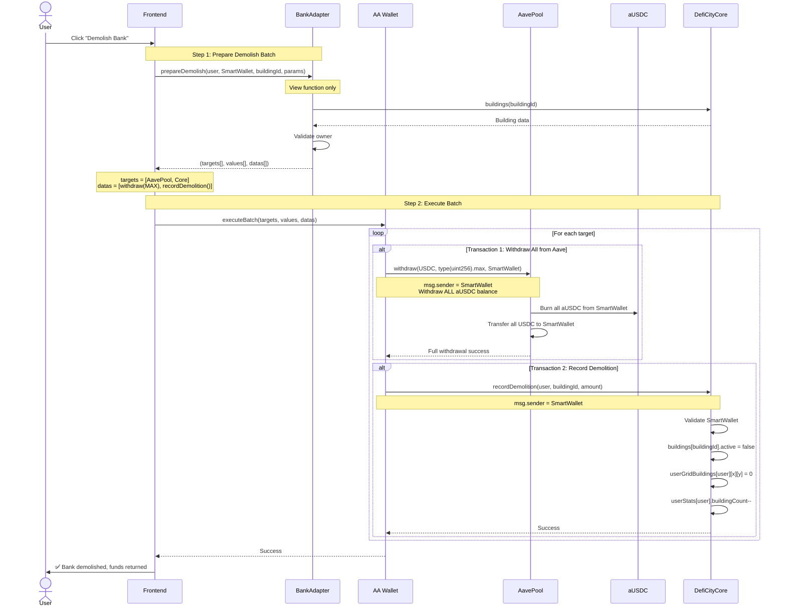
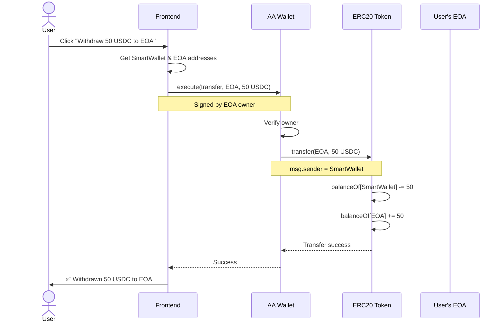

# DeFi City - Contract Architecture & Flow Diagrams

## Table of Contents
1. [Create Town Hall (First Time Setup)](#1-create-town-hall-first-time-setup)
2. [Deposit Asset (EOA → AA Wallet)](#2-deposit-asset-eoa--aa-wallet)
3. [Create Bank Building (Supply to Aave)](#3-create-bank-building-supply-to-aave)
4. [Harvest Bank Rewards (Withdraw from Aave)](#4-harvest-bank-rewards-withdraw-from-aave)
5. [Demolish Bank Building (Full Withdrawal)](#5-demolish-bank-building-full-withdrawal)
6. [Withdraw Asset (AA Wallet → EOA)](#6-withdraw-asset-aa-wallet--eoa)
7. [Key Architecture Points](#key-architecture-points)

---

## 1️⃣ Create Town Hall (First Time Setup)



**Key Points:**
- First-time user setup
- WalletFactory deploys deterministic SmartWallet for user
- DefiCityCore tracks EOA ↔ SmartWallet mapping
- Town Hall is the first building (no asset required)

---

## 2️⃣ Deposit Asset (EOA → AA Wallet)



**Key Points:**
- User transfers assets from EOA to SmartWallet
- Required before building placement
- Simple ERC20 transfer pattern

---

## 3️⃣ Create Bank Building (Supply to Aave)



**Key Points:**
- **BankAdapter.preparePlace()** is view-only, returns batch data
- **SmartWallet.executeBatch()** executes all 3 transactions atomically
- If any transaction fails, entire batch reverts
- SmartWallet receives aUSDC (yield-bearing token)
- DefiCityCore validates msg.sender == userSmartWallet

**Important:** BankAdapter is NOT called during execution - it's only used to prepare the batch!

---

## 4️⃣ Harvest Bank Rewards (Withdraw from Aave)



**Key Points:**
- Partial withdrawal from Aave position
- aUSDC is burned, USDC is returned to SmartWallet
- DefiCityCore updates harvest statistics

---

## 5️⃣ Demolish Bank Building (Full Withdrawal)



**Key Points:**
- Complete withdrawal using `type(uint256).max`
- Building marked as inactive
- Grid position freed up
- All aUSDC burned, all USDC returned

---

## 6️⃣ Withdraw Asset (AA Wallet → EOA)



**Key Points:**
- Transfer assets back from SmartWallet to EOA
- User retains full control over funds
- Simple ERC20 transfer

---

## Key Architecture Points

### 🏗️ Contract Roles

#### **BankAdapter (Helper/Recipe Builder)**
```solidity
// View functions only - NO state changes
function preparePlace(...) external view returns (
    address[] memory targets,
    uint256[] memory values,
    bytes[] memory datas
)

// Returns batch transaction data:
// targets = [USDC, AavePool, DefiCityCore]
// values  = [0, 0, 0]
// datas   = [approve(), supply(), recordPlacement()]
```

**Responsibilities:**
- ✅ Prepare batch transaction data
- ✅ Validate placement parameters
- ✅ Calculate fees
- ❌ **NOT called during execution**
- ❌ **NO state changes**

#### **SmartWallet (AA Wallet / Execution Engine)**
```solidity
function executeBatch(
    address[] calldata dest,
    uint256[] calldata value,
    bytes[] calldata func
) external {
    require(msg.sender == owner);

    for (uint i = 0; i < dest.length; i++) {
        (bool success, ) = dest[i].call{value: value[i]}(func[i]);
        require(success);
    }
}
```

**Responsibilities:**
- ✅ Execute all protocol interactions
- ✅ Hold user assets (USDC, aUSDC, etc.)
- ✅ Act as msg.sender for all calls
- ✅ Verify owner signature

#### **DefiCityCore (Bookkeeper)**
```solidity
function recordBuildingPlacement(...) external {
    // ✅ Validate caller is user's SmartWallet
    require(msg.sender == userSmartWallets[user]);

    // Store building data
    buildings[id] = Building(...);
    userBuildings[user].push(id);
}
```

**Responsibilities:**
- ✅ Track buildings, stats, grid positions
- ✅ Validate SmartWallet ownership
- ❌ **NEVER holds user tokens**
- ❌ **Bookkeeping only**

---

### 🔐 Security Model

```
┌─────────────────────────────────────────┐
│ Security Validation Chain               │
├─────────────────────────────────────────┤
│ 1. EOA signs transaction                │
│ 2. SmartWallet validates owner          │
│ 3. DefiCityCore validates SmartWallet   │
└─────────────────────────────────────────┘

DefiCityCore.recordBuildingPlacement():
    require(msg.sender == userSmartWallets[user]);

    ⚠️ NOTE: Does NOT validate Adapter!
    ⚠️ Adapter is NOT in execution flow!
```

**Why this works:**
- Only the user's SmartWallet can execute
- Only the EOA owner can call SmartWallet
- DefiCityCore trusts SmartWallet, not Adapter

---

### ⚡ Gas Efficiency

**Pattern: View Function + Batch Execution**

```typescript
// ✅ EFFICIENT: 1 transaction
const [targets, values, datas] = await BankAdapter.preparePlace(...) // View call (free)
await SmartWallet.executeBatch(targets, values, datas) // 1 transaction

// ❌ INEFFICIENT: 2 transactions
await BankAdapter.executePlace(...) // Transaction 1
await DefiCityCore.recordBuilding(...) // Transaction 2
```

**Benefits:**
1. **Lower Gas**: Single transaction vs multiple
2. **Atomic Execution**: All-or-nothing
3. **Flexibility**: Adapter can be upgraded without changing SmartWallet
4. **No State**: Adapter doesn't need to store anything

---

### 🎯 Data Flow Summary

```
Frontend
    ↓ (View call - FREE)
BankAdapter.preparePlace()
    ↓ (Returns batch data)
Frontend
    ↓ (1 Transaction)
SmartWallet.executeBatch()
    ├─→ USDC.approve()
    ├─→ AavePool.supply()
    └─→ DefiCityCore.recordPlacement()
         ↓
    ✅ Success
```

**Key Insight:**
- BankAdapter is a **"Recipe Builder"**
- SmartWallet is the **"Chef"** that executes the recipe
- DefiCityCore is the **"Ledger"** that records what happened

---

### 📝 Contract Addresses (Base Sepolia)

```typescript
// Core Contracts
DefiCityCore:    0xf9678a801Bf0E16C3781157A859741B87c9bC8eF
WalletFactory:   0xdA507eDd7A24Fe36f2f3d8EC47FC29b3dFa76c85
BankAdapter:     0x4c614D612FE404406b0875bE01725EE07eb27592

// Aave V3 (Base Sepolia)
POOL:            0x6Ae43d3271ff6888e7Fc43Fd7321a503ff738951
POOL_PROVIDER:   0xe20fCBdBfFC4Dd138cE8b2E6FBb6CB49777ad64D

// Tokens
USDC (Official): 0xba50Cd2A20f6DA35D788639E581bca8d0B5d4D5f
WETH:            0x4200000000000000000000000000000000000006
```

---

## 🎓 Common Misconceptions

### ❌ Myth: "BankAdapter executes the transaction"
**✅ Reality:** BankAdapter only prepares the batch data (view function). SmartWallet executes everything.

### ❌ Myth: "DefiCityCore validates Adapter"
**✅ Reality:** DefiCityCore validates SmartWallet ownership. Adapter is not in the execution path.

### ❌ Myth: "Each step is a separate transaction"
**✅ Reality:** All steps execute in a single atomic transaction via `executeBatch()`.

### ❌ Myth: "DefiCityCore holds user funds"
**✅ Reality:** DefiCityCore is bookkeeping only. SmartWallet holds all user assets.

---

## 📚 Additional Resources

- **Aave V3 Docs**: https://docs.aave.com/developers/
- **ERC-4337 Account Abstraction**: https://eips.ethereum.org/EIPS/eip-4337
- **Base Sepolia Explorer**: https://sepolia.basescan.org/

---

**Last Updated:** 2026-01-28
