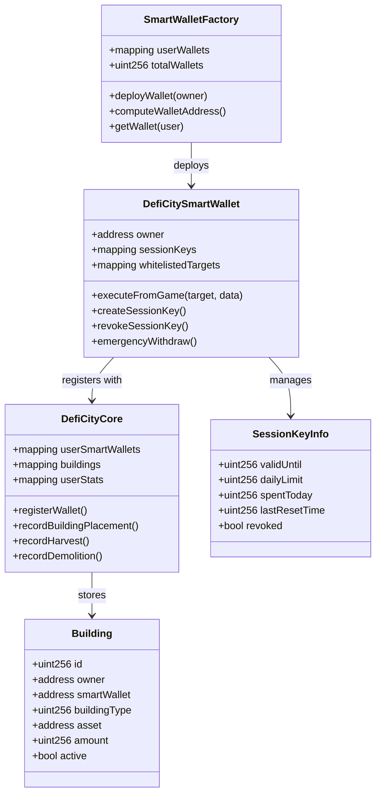
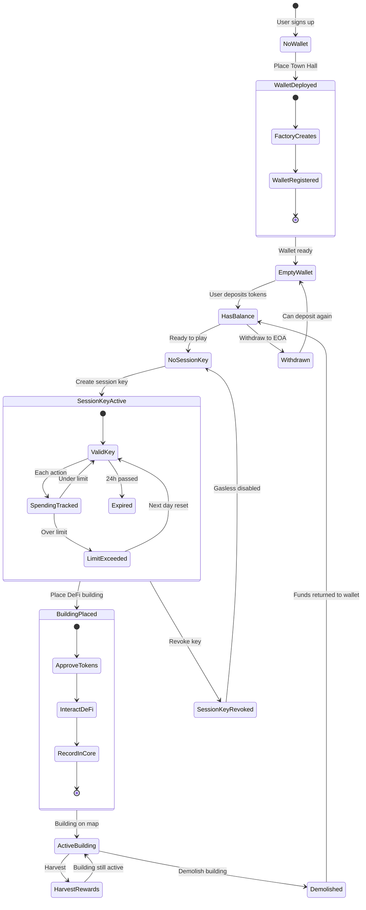

# DefiCity Smart Contract Design v2.0 (Self-Custodial)

**Version:** 2.0
**Last Updated:** 2026-01-15
**Architecture:** Self-Custodial (User-Owned SmartWallet)
**Solidity Version:** 0.8.24

---

## Table of Contents

1. [Architecture Overview](#architecture-overview)
2. [Contract Specifications](#contract-specifications)
   - [SmartWalletFactory](#1-smartwalletfactory)
   - [DefiCitySmartWallet](#2-deficitysmartwallet)
   - [DefiCityCore](#3-deficitycore)
   - [BuildingManager](#4-buildingmanager)
   - [FeeManager](#5-feemanager)
   - [EmergencyManager](#6-emergencymanager)
   - [DefiCityPaymaster](#7-deficitypaymaster)
3. [Interface Definitions](#interface-definitions)
4. [Data Structures](#data-structures)
5. [Security Considerations](#security-considerations)
6. [Gas Optimization](#gas-optimization)
7. [Upgrade Strategy](#upgrade-strategy)

---

## Architecture Overview

### Contract Hierarchy

```mermaid
graph TB
    subgraph User["👤 User Layer"]
        EOA[User EOA<br/>MetaMask]
    end

    subgraph Wallet["🏦 Custody Layer (User-Owned)"]
        SW[DefiCitySmartWallet<br/>ERC-4337 AA<br/>• Holds ALL tokens<br/>• Session keys<br/>• Owner: User EOA]
        Factory[SmartWalletFactory<br/>• Deploys wallets<br/>• CREATE2]
    end

    subgraph Game["🎮 Game Layer (Bookkeeping Only)"]
        Core[DefiCityCore<br/>• State storage<br/>• NO tokens<br/>• Immutable]
        BM[BuildingManager<br/>• Game logic<br/>• Swappable]
        FM[FeeManager<br/>• Fee calc<br/>• Swappable]
        EM[EmergencyManager<br/>• Pause/unpause<br/>• Swappable]
    end

    subgraph DeFi["💎 DeFi Protocols"]
        Aave[Aave V3<br/>Supply/Borrow]
        Aero[Aerodrome<br/>LP Pools]
        Mega[Megapot<br/>Lottery]
    end

    EOA -->|owns| SW
    EOA -->|Town Hall placement| Factory
    Factory -.->|deploys| SW

    SW -->|executeFromGame<br/>via session key| Core
    SW -->|direct calls| Aave
    SW -->|direct calls| Aero
    SW -->|direct calls| Mega

    BM -->|prepares calldata| SW
    Core <-->|state queries| BM
    Core <--> FM
    Core <--> EM

    style SW fill:#90EE90
    style Core fill:#87CEEB
    style Aave fill:#FFD700
    style Aero fill:#FFD700
    style Mega fill:#FFD700
```



### Key Principles

1. **Separation of Custody and Accounting**
   - SmartWallet: Custody layer (holds tokens)
   - Core/Modules: Accounting layer (tracks state)

2. **No Token Custody in Game Contracts**
   - DefiCityCore NEVER calls `transferFrom()` or holds tokens
   - Only tracks game state in mappings

3. **Session Key Authorization**
   - SmartWallet owner creates session key
   - Session key has limited permissions (time, value, targets)
   - Game uses session key to execute on behalf of user

4. **Direct Protocol Interaction**
   - No strategy contracts
   - SmartWallet calls Aave/Aerodrome/Megapot directly

---

## Flow Diagrams

### 1. Town Hall Deployment Flow (Wallet Creation)

```mermaid
sequenceDiagram
    actor User
    participant UI as Frontend
    participant Factory as SmartWalletFactory
    participant SW as SmartWallet
    participant Core as DefiCityCore
    participant Paymaster as Paymaster

    User->>UI: Click "Place Town Hall"
    UI->>UI: Check if wallet exists
    alt No wallet exists
        UI->>Factory: computeWalletAddress(userEOA)
        Factory-->>UI: Predicted address
        UI->>User: Show: "Your wallet: 0xABC..."
        User->>UI: Confirm placement

        UI->>Paymaster: Request gas sponsorship
        Paymaster-->>UI: Approved (gasless)

        UI->>Factory: deployWallet(userEOA)
        Factory->>SW: Deploy with CREATE2
        activate SW
        Factory->>Factory: userWallets[EOA] = SW
        Factory-->>UI: Wallet deployed ✓

        SW->>Core: registerWallet()
        Core->>Core: userSmartWallets[EOA] = SW
        Core->>Core: Record Town Hall building
        Core-->>SW: Registered ✓

        SW-->>UI: Town Hall placed
        deactivate SW
        UI->>User: Show Town Hall on map 🏛️
    else Wallet exists
        UI->>User: Error: "Town Hall already placed"
    end
```



### 2. DeFi Building Placement Flow (e.g., Bank Building)

```mermaid
sequenceDiagram
    actor User
    participant UI as Frontend
    participant SW as SmartWallet
    participant BM as BuildingManager
    participant Aave as Aave V3
    participant Core as DefiCityCore

    User->>UI: Click "Place Bank"<br/>100 USDC supply
    UI->>BM: prepareBankBuilding(SW, USDC, 100, x, y)
    BM-->>UI: [approve, supply, record]

    Note over UI: User has session key active

    UI->>SW: executeFromGameBatch([targets], [data])
    activate SW

    SW->>SW: Validate session key
    SW->>SW: Check daily limit
    SW->>SW: Track spending

    rect rgb(200, 220, 240)
        Note over SW,Aave: Execute DeFi interactions
        SW->>Aave: USDC.approve(AavePool, 100)
        Aave-->>SW: Approved ✓
        SW->>Aave: Pool.supply(USDC, 100, SW, 0)
        Aave->>SW: Transfer aUSDC (interest-bearing)
        Aave-->>SW: Supplied ✓
    end

    SW->>Core: recordBuildingPlacement(BANK, USDC, 100, x, y)
    Core->>Core: buildings[id] = Building{...}
    Core->>Core: gridBuildings[x][y] = id
    Core-->>SW: Recorded ✓

    deactivate SW
    SW-->>UI: Transaction complete
    UI->>User: Show Bank on map 🏦
```



### 3. Session Key Flow

```mermaid
sequenceDiagram
    actor User
    participant UI as Frontend
    participant SW as SmartWallet
    participant SessionKey as Session Key
    participant Game as Game Backend

    User->>UI: Click "Enable Gasless Gameplay"
    UI->>UI: Generate session key pair
    UI->>User: Show terms:<br/>• Valid 24h<br/>• 1000 USDC limit<br/>• Approved targets only
    User->>UI: Approve

    UI->>SW: createSessionKey(key, validUntil, dailyLimit)
    activate SW
    SW->>SW: sessionKeys[key] = SessionKeyInfo{...}
    SW-->>UI: Session key created ✓
    deactivate SW

    UI->>UI: Store session key (encrypted)
    UI->>User: Show "Gasless Enabled ⚡"

    loop Every game action
        User->>UI: Place/Harvest/Demolish
        UI->>SessionKey: Sign UserOperation
        SessionKey-->>UI: Signature
        UI->>Game: Submit UserOp (gasless)
        Game->>SW: executeFromGame(target, data)
        activate SW
        SW->>SW: Validate session key<br/>• Not expired?<br/>• Not revoked?<br/>• Under daily limit?
        alt Valid
            SW->>SW: Execute action
            SW->>SW: Track spending
            SW-->>Game: Success ✓
        else Invalid
            SW-->>Game: Revert ❌
        end
        deactivate SW
        Game-->>UI: Result
        UI->>User: Update UI
    end

    alt User wants to revoke
        User->>UI: Click "Revoke Session Key"
        UI->>SW: revokeSessionKey(key)
        SW->>SW: sessionKeys[key].revoked = true
        SW-->>UI: Revoked ✓
        UI->>User: "Gasless Disabled"
    end
```



### 4. Asset Flow Diagram

```mermaid
graph LR
    subgraph "User's Control"
        EOA[👤 User EOA<br/>MetaMask]
        SW[🏦 SmartWallet<br/>ALL tokens here]
    end

    subgraph "DeFi Protocols"
        Aave[Aave V3<br/>aTokens]
        Aero[Aerodrome<br/>LP tokens]
        Mega[Megapot<br/>Lottery tickets]
    end

    subgraph "Game (NO tokens)"
        Core[DefiCityCore<br/>Bookkeeping ONLY]
    end

    EOA -->|1. Deposit<br/>User pays gas| SW
    SW -->|2. Supply<br/>Gasless| Aave
    SW -->|2. Add Liquidity<br/>Gasless| Aero
    SW -->|2. Buy Tickets<br/>Gasless| Mega

    Aave -.->|aTokens in| SW
    Aero -.->|LP tokens in| SW
    Mega -.->|Tickets owned by| SW

    Aave -->|3. Harvest<br/>Gasless| SW
    Aero -->|3. Harvest<br/>Gasless| SW

    SW -->|4. Withdraw<br/>User pays gas| EOA

    SW -.->|Record actions| Core

    style SW fill:#90EE90
    style Core fill:#87CEEB
    style Aave fill:#FFD700
    style Aero fill:#FFD700
    style Mega fill:#FFD700

    Note1[All assets in SmartWallet<br/>User always in control]
    style Note1 fill:#FFF3CD
```



### 5. Complete User Journey

```mermaid
flowchart TD
    Start([👤 User Signs Up]) --> NoWallet{Has<br/>SmartWallet?}

    NoWallet -->|No| TownHall[🏛️ Place Town Hall]
    TownHall --> Deploy[Factory deploys SmartWallet]
    Deploy --> WalletCreated[✅ SmartWallet Created<br/>User is owner]

    NoWallet -->|Yes| HasWallet[User has wallet]
    WalletCreated --> HasWallet

    HasWallet --> CheckBalance{Has<br/>balance?}

    CheckBalance -->|No| Deposit[💰 Deposit to SmartWallet<br/>User pays gas]
    Deposit --> HasBalance[Balance > 0]

    CheckBalance -->|Yes| HasBalance

    HasBalance --> SessionKey{Session key<br/>active?}

    SessionKey -->|No| CreateKey[⚡ Create Session Key<br/>One-time setup]
    CreateKey --> Gasless[Gasless gameplay enabled]

    SessionKey -->|Yes| Gasless

    Gasless --> Actions[Game Actions<br/>All gasless]

    Actions --> Bank[🏦 Place Bank<br/>Supply to Aave]
    Actions --> Shop[🏪 Place Shop<br/>Add Aerodrome LP]
    Actions --> Lottery[🎰 Place Lottery<br/>Buy Megapot tickets]

    Bank --> Harvest1[🌾 Harvest interest]
    Shop --> Harvest2[🌾 Harvest fees + AERO]
    Lottery --> CheckWin[🎁 Check winnings]

    Harvest1 --> Grow[💰 Balance grows]
    Harvest2 --> Grow
    CheckWin --> Grow

    Grow --> Continue{Continue<br/>playing?}
    Continue -->|Yes| Actions
    Continue -->|No| Withdraw[🏧 Withdraw to EOA<br/>User pays gas]

    Withdraw --> End([✅ End])

    style Start fill:#E7F3FF
    style WalletCreated fill:#90EE90
    style Gasless fill:#FFE5B4
    style Bank fill:#FFD700
    style Shop fill:#FFD700
    style Lottery fill:#FFD700
    style End fill:#E7F3FF
```



---

## Contract Specifications

## 1. SmartWalletFactory

**Purpose:** Factory contract to deploy SmartWallets when users place Town Hall

**File:** `src/SmartWalletFactory.sol`

### 1.1 Overview

The SmartWalletFactory is responsible for deploying new DefiCitySmartWallet instances when users place their Town Hall building. This is the ONLY way to create SmartWallets in the system, ensuring:
- One wallet per user
- Proper initialization
- Gasless deployment (via Paymaster)
- Automatic registration with Core

### 1.2 Contract Implementation

```solidity
// SPDX-License-Identifier: MIT
pragma solidity 0.8.24;

import "@account-abstraction/contracts/interfaces/IEntryPoint.sol";
import "./DefiCitySmartWallet.sol";
import "./DefiCityCore.sol";

/**
 * @title SmartWalletFactory
 * @notice Factory for deploying SmartWallets on Town Hall placement
 * @dev Uses CREATE2 for deterministic addresses
 */
contract SmartWalletFactory {

    // ============ Immutables ============

    /// @notice ERC-4337 EntryPoint
    IEntryPoint public immutable entryPoint;

    /// @notice DefiCity Core contract
    DefiCityCore public immutable core;

    // ============ State Variables ============

    /// @notice Mapping of user EOA → deployed SmartWallet
    mapping(address => address) public userWallets;

    /// @notice Total wallets deployed
    uint256 public totalWallets;

    // ============ Events ============

    event WalletDeployed(
        address indexed user,
        address indexed wallet,
        uint256 walletNumber
    );

    // ============ Errors ============

    error WalletAlreadyExists();
    error DeploymentFailed();

    // ============ Constructor ============

    constructor(IEntryPoint _entryPoint, address _core) {
        entryPoint = _entryPoint;
        core = DefiCityCore(_core);
    }

    // ============ Main Functions ============

    /**
     * @notice Deploy SmartWallet for user (called when placing Town Hall)
     * @dev Uses CREATE2 for deterministic address
     * @param owner User's EOA address
     * @return wallet Address of deployed SmartWallet
     */
    function deployWallet(address owner) external returns (address wallet) {
        // Check if user already has a wallet
        if (userWallets[owner] != address(0)) revert WalletAlreadyExists();

        // Use CREATE2 for deterministic deployment
        bytes32 salt = keccak256(abi.encodePacked(owner, totalWallets));

        // Deploy new SmartWallet
        DefiCitySmartWallet newWallet = new DefiCitySmartWallet{salt: salt}(
            entryPoint,
            address(core),
            owner
        );

        wallet = address(newWallet);

        // Register wallet
        userWallets[owner] = wallet;
        totalWallets++;

        // Register with Core
        // Note: User must call Core.registerWallet() themselves
        // to ensure they control the registration

        emit WalletDeployed(owner, wallet, totalWallets);

        return wallet;
    }

    /**
     * @notice Compute the address of a SmartWallet before deployment
     * @dev Useful for UI to show address before user confirms
     * @param owner User's EOA address
     * @param walletNumber Wallet number (use totalWallets for next wallet)
     * @return Address that the wallet will have
     */
    function computeWalletAddress(
        address owner,
        uint256 walletNumber
    ) external view returns (address) {
        bytes32 salt = keccak256(abi.encodePacked(owner, walletNumber));

        bytes memory bytecode = abi.encodePacked(
            type(DefiCitySmartWallet).creationCode,
            abi.encode(entryPoint, address(core), owner)
        );

        bytes32 hash = keccak256(
            abi.encodePacked(
                bytes1(0xff),
                address(this),
                salt,
                keccak256(bytecode)
            )
        );

        return address(uint160(uint256(hash)));
    }

    /**
     * @notice Get wallet address for a user
     * @param user User's EOA address
     * @return wallet SmartWallet address (or address(0) if not deployed)
     */
    function getWallet(address user) external view returns (address) {
        return userWallets[user];
    }

    /**
     * @notice Check if user has a wallet
     * @param user User's EOA address
     * @return hasWallet True if wallet exists
     */
    function hasWallet(address user) external view returns (bool) {
        return userWallets[user] != address(0);
    }
}
```

### 1.3 Usage Flow

**When User Places Town Hall:**

```javascript
// Frontend code
async function placeTownHall(userEOA, x, y) {
  // 1. Check if user already has wallet
  const existingWallet = await factory.userWallets(userEOA);
  if (existingWallet !== ethers.ZeroAddress) {
    throw new Error("Town Hall already placed");
  }

  // 2. Show preview of wallet address
  const nextWalletNumber = await factory.totalWallets();
  const predictedAddress = await factory.computeWalletAddress(
    userEOA,
    nextWalletNumber
  );

  console.log("Your SmartWallet will be:", predictedAddress);

  // 3. Prepare UserOperation (gasless)
  const userOp = {
    sender: predictedAddress, // Will be created
    callData: factory.interface.encodeFunctionData("deployWallet", [userEOA]),
    // ... other ERC-4337 fields
  };

  // 4. Submit via Bundler (Paymaster sponsors gas)
  const bundler = new Bundler(BUNDLER_URL);
  const txHash = await bundler.sendUserOperation(userOp);

  // 5. Wait for deployment
  await txHash.wait();

  // 6. Wallet is now deployed!
  const walletAddress = await factory.userWallets(userEOA);

  // 7. Register wallet with Core
  await wallet.registerWallet(); // Calls Core.registerWallet()

  // 8. Record Town Hall placement
  // This happens inside registerWallet() call to Core
}
```

### 1.4 Security Considerations

1. **One Wallet Per User:** Mapping prevents duplicate wallets
2. **Deterministic Addresses:** CREATE2 ensures predictable addresses
3. **Owner Control:** Only the owner can control the deployed wallet
4. **Gasless Deployment:** Paymaster sponsors deployment cost
5. **No Admin Control:** Factory has no special privileges after deployment

---

## 2. DefiCitySmartWallet

**Purpose:** User-owned ERC-4337 smart contract wallet that holds all assets

**File:** `src/DefiCitySmartWallet.sol`

**Note:** Deployed by SmartWalletFactory when user places Town Hall

### 2.1 State Variables

```solidity
// SPDX-License-Identifier: MIT
pragma solidity 0.8.24;

import "@account-abstraction/contracts/core/BaseAccount.sol";
import "@account-abstraction/contracts/interfaces/IEntryPoint.sol";
import "@openzeppelin/contracts/token/ERC20/IERC20.sol";
import "@openzeppelin/contracts/token/ERC20/utils/SafeERC20.sol";

contract DefiCitySmartWallet is BaseAccount {
    using SafeERC20 for IERC20;

    // ============ Immutables ============

    /// @notice ERC-4337 EntryPoint
    IEntryPoint public immutable entryPoint;

    /// @notice DefiCity Core contract (for bookkeeping calls)
    address public immutable core;

    // ============ State Variables ============

    /// @notice Owner of this wallet (user's EOA)
    address public owner;

    /// @notice Session key information
    struct SessionKeyInfo {
        uint256 validUntil;      // Expiry timestamp
        uint256 dailyLimit;      // Max USD value per day
        uint256 spentToday;      // Amount spent today
        uint256 lastResetTime;   // Last daily reset
        bool revoked;            // Revocation flag
    }

    /// @notice Mapping of session key address to info
    mapping(address => SessionKeyInfo) public sessionKeys;

    /// @notice Whitelisted target contracts (DeFi protocols + Core)
    mapping(address => bool) public whitelistedTargets;

    /// @notice Nonce for replay protection (ERC-4337)
    uint256 private _nonce;

    // ============ Events ============

    event SessionKeyCreated(
        address indexed sessionKey,
        uint256 validUntil,
        uint256 dailyLimit
    );

    event SessionKeyRevoked(address indexed sessionKey);

    event SessionKeyUsed(
        address indexed sessionKey,
        address indexed target,
        uint256 value,
        bytes data
    );

    event ExecutedFromGame(
        address indexed target,
        uint256 value,
        bytes data,
        bytes result
    );

    event EmergencyWithdrawal(
        address indexed token,
        address indexed to,
        uint256 amount
    );

    event TargetWhitelisted(address indexed target, bool status);

    // ============ Errors ============

    error OnlyOwner();
    error OnlyEntryPoint();
    error OnlySessionKey();
    error SessionKeyExpired();
    error SessionKeyRevoked();
    error DailyLimitExceeded();
    error TargetNotWhitelisted();
    error InvalidSessionKey();
    error ExecutionFailed();

    // ============ Modifiers ============

    modifier onlyOwner() {
        if (msg.sender != owner) revert OnlyOwner();
        _;
    }

    modifier onlyEntryPoint() {
        if (msg.sender != address(entryPoint)) revert OnlyEntryPoint();
        _;
    }

    modifier onlyValidSessionKey() {
        SessionKeyInfo storage info = sessionKeys[msg.sender];
        if (info.validUntil == 0) revert InvalidSessionKey();
        if (block.timestamp >= info.validUntil) revert SessionKeyExpired();
        if (info.revoked) revert SessionKeyRevoked();
        _;

        // Reset daily spending if new day
        if (block.timestamp >= info.lastResetTime + 1 days) {
            info.spentToday = 0;
            info.lastResetTime = block.timestamp;
        }
    }

    // ============ Constructor ============

    constructor(
        IEntryPoint _entryPoint,
        address _core,
        address _owner
    ) {
        entryPoint = _entryPoint;
        core = _core;
        owner = _owner;

        // Whitelist Core contract for bookkeeping calls
        whitelistedTargets[_core] = true;
    }

    // ============ ERC-4337 Implementation ============

    /// @inheritdoc BaseAccount
    function _validateSignature(
        UserOperation calldata userOp,
        bytes32 userOpHash
    ) internal virtual override returns (uint256) {
        bytes32 hash = userOpHash.toEthSignedMessageHash();

        // Check if signed by owner
        if (owner == hash.recover(userOp.signature)) {
            return 0; // Valid signature
        }

        // Check if signed by valid session key
        address signer = hash.recover(userOp.signature);
        SessionKeyInfo storage info = sessionKeys[signer];

        if (info.validUntil > 0 &&
            block.timestamp < info.validUntil &&
            !info.revoked) {
            return 0; // Valid session key signature
        }

        return 1; // Invalid signature
    }

    /// @inheritdoc BaseAccount
    function entryPoint() public view virtual override returns (IEntryPoint) {
        return entryPoint;
    }

    /// @notice Get nonce for ERC-4337
    function getNonce() public view virtual override returns (uint256) {
        return _nonce;
    }

    // ============ Session Key Management ============

    /**
     * @notice Create a new session key
     * @param key Address of the session key
     * @param validUntil Expiry timestamp
     * @param dailyLimit Daily spending limit in USD (18 decimals)
     */
    function createSessionKey(
        address key,
        uint256 validUntil,
        uint256 dailyLimit
    ) external onlyOwner {
        require(key != address(0), "Invalid key");
        require(validUntil > block.timestamp, "Invalid expiry");
        require(validUntil <= block.timestamp + 30 days, "Max 30 days");

        sessionKeys[key] = SessionKeyInfo({
            validUntil: validUntil,
            dailyLimit: dailyLimit,
            spentToday: 0,
            lastResetTime: block.timestamp,
            revoked: false
        });

        emit SessionKeyCreated(key, validUntil, dailyLimit);
    }

    /**
     * @notice Revoke a session key
     * @param key Address of the session key to revoke
     */
    function revokeSessionKey(address key) external onlyOwner {
        sessionKeys[key].revoked = true;
        emit SessionKeyRevoked(key);
    }

    // ============ Target Whitelist Management ============

    /**
     * @notice Whitelist or remove a target contract
     * @param target Contract address
     * @param status True to whitelist, false to remove
     */
    function setWhitelistedTarget(
        address target,
        bool status
    ) external onlyOwner {
        whitelistedTargets[target] = status;
        emit TargetWhitelisted(target, status);
    }

    // ============ Game Execution Functions ============

    /**
     * @notice Execute a call to DeFi protocol via session key
     * @dev Called by game backend with session key authorization
     * @param target DeFi protocol address (Aave, Aerodrome, Megapot)
     * @param value ETH value to send
     * @param data Encoded function call
     * @return result Bytes returned from the call
     */
    function executeFromGame(
        address target,
        uint256 value,
        bytes calldata data
    ) external onlyValidSessionKey returns (bytes memory result) {
        // Validate target is whitelisted
        if (!whitelistedTargets[target]) revert TargetNotWhitelisted();

        // Track spending for session key limits
        SessionKeyInfo storage info = sessionKeys[msg.sender];
        uint256 estimatedValue = _estimateValue(target, value, data);

        if (info.spentToday + estimatedValue > info.dailyLimit) {
            revert DailyLimitExceeded();
        }

        info.spentToday += estimatedValue;

        // Execute the call
        (bool success, bytes memory returnData) = target.call{value: value}(data);
        if (!success) {
            // Revert with the original error message
            assembly {
                revert(add(returnData, 32), mload(returnData))
            }
        }

        emit ExecutedFromGame(target, value, data, returnData);
        emit SessionKeyUsed(msg.sender, target, estimatedValue, data);

        return returnData;
    }

    /**
     * @notice Execute batch calls to DeFi protocols
     * @param targets Array of target addresses
     * @param values Array of ETH values
     * @param datas Array of encoded function calls
     * @return results Array of return data
     */
    function executeFromGameBatch(
        address[] calldata targets,
        uint256[] calldata values,
        bytes[] calldata datas
    ) external onlyValidSessionKey returns (bytes[] memory results) {
        require(
            targets.length == values.length && values.length == datas.length,
            "Length mismatch"
        );

        results = new bytes[](targets.length);

        for (uint256 i = 0; i < targets.length; i++) {
            results[i] = this.executeFromGame(targets[i], values[i], datas[i]);
        }

        return results;
    }

    // ============ Bookkeeping Functions ============

    /**
     * @notice Record building placement in Core
     * @dev Called internally after successful DeFi interaction
     */
    function _recordInCore(
        uint256 buildingType,
        address asset,
        uint256 amount,
        uint256 x,
        uint256 y
    ) internal {
        bytes memory data = abi.encodeWithSignature(
            "recordBuildingPlacement(uint256,address,uint256,uint256,uint256)",
            buildingType,
            asset,
            amount,
            x,
            y
        );

        (bool success, ) = core.call(data);
        require(success, "Core recording failed");
    }

    // ============ Emergency Functions ============

    /**
     * @notice Emergency withdrawal (owner only)
     * @dev Allows owner to withdraw tokens directly, bypassing game
     * @param token Token address (address(0) for ETH)
     * @param to Recipient address
     * @param amount Amount to withdraw
     */
    function emergencyWithdraw(
        address token,
        address to,
        uint256 amount
    ) external onlyOwner {
        if (token == address(0)) {
            // Withdraw ETH
            (bool success, ) = to.call{value: amount}("");
            require(success, "ETH transfer failed");
        } else {
            // Withdraw ERC20
            IERC20(token).safeTransfer(to, amount);
        }

        emit EmergencyWithdrawal(token, to, amount);
    }

    // ============ View Functions ============

    /**
     * @notice Get token balance
     * @param token Token address
     * @return balance Token balance
     */
    function getBalance(address token) external view returns (uint256) {
        if (token == address(0)) {
            return address(this).balance;
        }
        return IERC20(token).balanceOf(address(this));
    }

    /**
     * @notice Get session key info
     * @param key Session key address
     * @return info SessionKeyInfo struct
     */
    function getSessionKeyInfo(
        address key
    ) external view returns (SessionKeyInfo memory) {
        return sessionKeys[key];
    }

    /**
     * @notice Check if session key is valid
     * @param key Session key address
     * @return valid True if valid
     */
    function isValidSessionKey(address key) external view returns (bool) {
        SessionKeyInfo storage info = sessionKeys[key];
        return info.validUntil > 0 &&
               block.timestamp < info.validUntil &&
               !info.revoked;
    }

    // ============ Internal Helpers ============

    /**
     * @notice Estimate USD value of a transaction
     * @dev Used for session key daily limits
     */
    function _estimateValue(
        address target,
        uint256 value,
        bytes memory data
    ) internal view returns (uint256) {
        // If sending ETH, use that value
        if (value > 0) {
            // TODO: Convert ETH to USD using price oracle
            return value;
        }

        // Parse function call to extract token amounts
        bytes4 selector = bytes4(data);

        // Aave supply/withdraw
        if (selector == bytes4(keccak256("supply(address,uint256,address,uint16)"))) {
            (, uint256 amount, , ) = abi.decode(
                _slice(data, 4, data.length - 4),
                (address, uint256, address, uint16)
            );
            return amount; // Assume 1:1 for stablecoins
        }

        // Default: return 0 (no value tracking for this call)
        return 0;
    }

    /**
     * @notice Slice bytes
     */
    function _slice(
        bytes memory data,
        uint256 start,
        uint256 length
    ) internal pure returns (bytes memory) {
        bytes memory result = new bytes(length);
        for (uint256 i = 0; i < length; i++) {
            result[i] = data[start + i];
        }
        return result;
    }

    // ============ Receive ETH ============

    receive() external payable {}
}
```

---

## 2. DefiCityCore

**Purpose:** Immutable bookkeeping contract that tracks game state (NO token custody)

**File:** `src/DefiCityCore.sol`

### 2.1 State Variables

```solidity
// SPDX-License-Identifier: MIT
pragma solidity 0.8.24;

import "@openzeppelin/contracts/utils/ReentrancyGuard.sol";
import "@openzeppelin/contracts/utils/Pausable.sol";

/**
 * @title DefiCityCore
 * @notice Core bookkeeping contract - NEVER holds user tokens
 * @dev All token custody is in user's SmartWallet
 */
contract DefiCityCore is ReentrancyGuard, Pausable {

    // ============ Constants ============

    uint256 public constant BUILDING_TYPE_TOWNHALL = 0;
    uint256 public constant BUILDING_TYPE_BANK = 1;
    uint256 public constant BUILDING_TYPE_SHOP = 2;
    uint256 public constant BUILDING_TYPE_LOTTERY = 3;

    // ============ State Variables ============

    /// @notice Protocol owner
    address public owner;

    /// @notice Treasury for fees
    address public treasury;

    /// @notice Supported assets
    mapping(address => bool) public supportedAssets;

    /// @notice User EOA → SmartWallet mapping
    mapping(address => address) public userSmartWallets;

    /// @notice Module addresses
    address public buildingManager;
    address public feeManager;
    address public emergencyManager;

    /// @notice Building counter
    uint256 public buildingIdCounter;

    /// @notice Building data
    struct Building {
        uint256 id;
        address owner;          // User's EOA
        address smartWallet;    // User's SmartWallet
        uint256 buildingType;   // 0=TownHall, 1=Bank, 2=Shop, 3=Lottery
        address asset;          // Asset type (USDC, ETH, etc.)
        uint256 amount;         // Initial amount invested
        uint256 placedAt;       // Timestamp
        uint256 coordinateX;    // Map position
        uint256 coordinateY;    // Map position
        bool active;            // Is building active
    }

    /// @notice buildingId → Building
    mapping(uint256 => Building) public buildings;

    /// @notice User EOA → buildingIds[]
    mapping(address => uint256[]) public userBuildings;

    /// @notice Grid position → buildingId
    mapping(uint256 => mapping(uint256 => uint256)) public gridBuildings;

    /// @notice User statistics (for leaderboard/analytics)
    struct UserStats {
        uint256 totalDeposited;   // Lifetime deposits (bookkeeping)
        uint256 totalWithdrawn;   // Lifetime withdrawals (bookkeeping)
        uint256 totalHarvested;   // Lifetime harvested
        uint256 buildingCount;    // Active buildings
        uint256 cityCreatedAt;    // First interaction
    }

    mapping(address => UserStats) public userStats;

    // ============ Events ============

    event WalletRegistered(address indexed user, address indexed smartWallet);

    event BuildingPlaced(
        uint256 indexed buildingId,
        address indexed user,
        address indexed smartWallet,
        uint256 buildingType,
        address asset,
        uint256 amount,
        uint256 x,
        uint256 y
    );

    event BuildingDemolished(
        uint256 indexed buildingId,
        address indexed user,
        uint256 returnedAmount
    );

    event Harvested(
        uint256 indexed buildingId,
        address indexed user,
        uint256 yieldAmount
    );

    event DepositRecorded(
        address indexed user,
        address indexed asset,
        uint256 amount
    );

    event WithdrawalRecorded(
        address indexed user,
        address indexed asset,
        uint256 amount
    );

    // ============ Errors ============

    error OnlyOwner();
    error OnlyUserWallet();
    error OnlyModules();
    error WalletAlreadyRegistered();
    error WalletNotRegistered();
    error InvalidOwner();
    error GridOccupied();

    // ============ Modifiers ============

    modifier onlyOwner() {
        if (msg.sender != owner) revert OnlyOwner();
        _;
    }

    modifier onlyUserWallet() {
        // msg.sender must be a registered SmartWallet
        // and ISmartWallet(msg.sender).owner() must be the user
        address walletOwner = ISmartWallet(msg.sender).owner();
        if (userSmartWallets[walletOwner] != msg.sender) {
            revert OnlyUserWallet();
        }
        _;
    }

    modifier onlyModules() {
        if (msg.sender != buildingManager &&
            msg.sender != feeManager &&
            msg.sender != emergencyManager) {
            revert OnlyModules();
        }
        _;
    }

    // ============ Constructor ============

    constructor(address _treasury) {
        owner = msg.sender;
        treasury = _treasury;
    }

    // ============ Wallet Registration ============

    /**
     * @notice Register user's SmartWallet
     * @dev Called once during onboarding
     * @param smartWallet Address of user's SmartWallet
     */
    function registerWallet(address smartWallet) external {
        if (userSmartWallets[msg.sender] != address(0)) {
            revert WalletAlreadyRegistered();
        }

        // Verify caller owns the SmartWallet
        address walletOwner = ISmartWallet(smartWallet).owner();
        if (walletOwner != msg.sender) revert InvalidOwner();

        userSmartWallets[msg.sender] = smartWallet;
        userStats[msg.sender].cityCreatedAt = block.timestamp;

        emit WalletRegistered(msg.sender, smartWallet);
    }

    // ============ Bookkeeping Functions (Called by SmartWallet) ============

    /**
     * @notice Record building placement
     * @dev Called BY user's SmartWallet after DeFi interaction
     */
    function recordBuildingPlacement(
        uint256 buildingType,
        address asset,
        uint256 amount,
        uint256 x,
        uint256 y
    ) external onlyUserWallet nonReentrant {
        // Get user (owner of calling SmartWallet)
        address user = ISmartWallet(msg.sender).owner();

        // Check grid position
        if (gridBuildings[x][y] != 0) revert GridOccupied();

        // Create building
        uint256 buildingId = ++buildingIdCounter;

        buildings[buildingId] = Building({
            id: buildingId,
            owner: user,
            smartWallet: msg.sender,
            buildingType: buildingType,
            asset: asset,
            amount: amount,
            placedAt: block.timestamp,
            coordinateX: x,
            coordinateY: y,
            active: true
        });

        userBuildings[user].push(buildingId);
        gridBuildings[x][y] = buildingId;
        userStats[user].buildingCount++;

        emit BuildingPlaced(
            buildingId,
            user,
            msg.sender,
            buildingType,
            asset,
            amount,
            x,
            y
        );
    }

    /**
     * @notice Record harvest
     * @dev Called BY user's SmartWallet after claiming rewards
     */
    function recordHarvest(
        uint256 buildingId,
        uint256 yieldAmount
    ) external onlyUserWallet {
        Building storage building = buildings[buildingId];
        require(building.active, "Building not active");
        require(building.smartWallet == msg.sender, "Not building owner");

        address user = ISmartWallet(msg.sender).owner();
        userStats[user].totalHarvested += yieldAmount;

        emit Harvested(buildingId, user, yieldAmount);
    }

    /**
     * @notice Record building demolition
     * @dev Called BY user's SmartWallet after withdrawing from DeFi
     */
    function recordDemolition(
        uint256 buildingId,
        uint256 returnedAmount
    ) external onlyUserWallet {
        Building storage building = buildings[buildingId];
        require(building.active, "Building not active");
        require(building.smartWallet == msg.sender, "Not building owner");

        building.active = false;

        address user = ISmartWallet(msg.sender).owner();
        userStats[user].buildingCount--;

        // Clear grid
        gridBuildings[building.coordinateX][building.coordinateY] = 0;

        emit BuildingDemolished(buildingId, user, returnedAmount);
    }

    /**
     * @notice Record deposit for analytics
     * @dev Called when user transfers to their SmartWallet
     */
    function recordDeposit(
        address asset,
        uint256 amount
    ) external {
        address smartWallet = userSmartWallets[msg.sender];
        if (smartWallet == address(0)) revert WalletNotRegistered();

        userStats[msg.sender].totalDeposited += amount;

        emit DepositRecorded(msg.sender, asset, amount);
    }

    /**
     * @notice Record withdrawal for analytics
     * @dev Called when user withdraws from SmartWallet to EOA
     */
    function recordWithdrawal(
        address asset,
        uint256 amount
    ) external {
        address smartWallet = userSmartWallets[msg.sender];
        if (smartWallet == address(0)) revert WalletNotRegistered();

        userStats[msg.sender].totalWithdrawn += amount;

        emit WithdrawalRecorded(msg.sender, asset, amount);
    }

    // ============ View Functions ============

    /**
     * @notice Get user's buildings
     */
    function getUserBuildings(
        address user
    ) external view returns (Building[] memory) {
        uint256[] memory buildingIds = userBuildings[user];
        Building[] memory result = new Building[](buildingIds.length);

        for (uint256 i = 0; i < buildingIds.length; i++) {
            result[i] = buildings[buildingIds[i]];
        }

        return result;
    }

    /**
     * @notice Get building at grid position
     */
    function getBuildingAt(
        uint256 x,
        uint256 y
    ) external view returns (Building memory) {
        uint256 buildingId = gridBuildings[x][y];
        return buildings[buildingId];
    }

    // ============ Admin Functions ============

    /**
     * @notice Set module addresses
     */
    function setModules(
        address _buildingManager,
        address _feeManager,
        address _emergencyManager
    ) external onlyOwner {
        buildingManager = _buildingManager;
        feeManager = _feeManager;
        emergencyManager = _emergencyManager;
    }

    /**
     * @notice Add supported asset
     */
    function addSupportedAsset(address asset) external onlyOwner {
        supportedAssets[asset] = true;
    }

    /**
     * @notice Pause contract
     */
    function pause() external onlyOwner {
        _pause();
    }

    /**
     * @notice Unpause contract
     */
    function unpause() external onlyOwner {
        _unpause();
    }
}

// ============ Interface ============

interface ISmartWallet {
    function owner() external view returns (address);
}
```

---

## 3. BuildingManager

**Purpose:** Game logic for building placement and management

**File:** `src/BuildingManager.sol`

### 3.1 Contract Implementation

```solidity
// SPDX-License-Identifier: MIT
pragma solidity 0.8.24;

import "./interfaces/IPool.sol";
import "./interfaces/IRouter.sol";
import "./DefiCityCore.sol";

/**
 * @title BuildingManager
 * @notice Manages building placement logic and prepares DeFi interactions
 * @dev Does NOT hold tokens - prepares calls for SmartWallet execution
 */
contract BuildingManager {

    // ============ Constants ============

    uint256 public constant MIN_BANK_AMOUNT = 100 * 1e6;  // $100 USDC
    uint256 public constant MIN_SHOP_AMOUNT = 500 * 1e6;  // $500 USDC
    uint256 public constant MIN_LOTTERY_AMOUNT = 10 * 1e6; // $10 USDC

    // ============ State Variables ============

    DefiCityCore public immutable core;

    /// @notice DeFi protocol addresses (Base Mainnet)
    address public aavePool;
    address public aerodromeRouter;
    address public megapotLottery;

    /// @notice Fee percentage (basis points)
    uint256 public placementFeeBps = 5; // 0.05%

    // ============ Constructor ============

    constructor(address _core) {
        core = DefiCityCore(_core);
    }

    // ============ Building Placement Preparation ============

    /**
     * @notice Prepare Aave bank building (supply only)
     * @dev Returns calldata for SmartWallet to execute
     * @param userSmartWallet User's SmartWallet address
     * @param asset Asset to supply
     * @param amount Amount to supply
     * @param x Grid X coordinate
     * @param y Grid Y coordinate
     * @return targets Array of target addresses
     * @return values Array of ETH values
     * @return datas Array of encoded calls
     */
    function prepareBankBuilding(
        address userSmartWallet,
        address asset,
        uint256 amount,
        uint256 x,
        uint256 y
    ) external view returns (
        address[] memory targets,
        uint256[] memory values,
        bytes[] memory datas
    ) {
        require(amount >= MIN_BANK_AMOUNT, "Below minimum");

        // Prepare batch: [approve, supply, recordBuilding]
        targets = new address[](3);
        values = new uint256[](3);
        datas = new bytes[](3);

        // 1. Approve Aave Pool
        targets[0] = asset;
        values[0] = 0;
        datas[0] = abi.encodeWithSelector(
            IERC20.approve.selector,
            aavePool,
            amount
        );

        // 2. Supply to Aave
        targets[1] = aavePool;
        values[1] = 0;
        datas[1] = abi.encodeWithSelector(
            IPool.supply.selector,
            asset,
            amount,
            userSmartWallet,  // onBehalfOf
            0                 // referralCode
        );

        // 3. Record in Core
        targets[2] = address(core);
        values[2] = 0;
        datas[2] = abi.encodeWithSelector(
            DefiCityCore.recordBuildingPlacement.selector,
            core.BUILDING_TYPE_BANK(),
            asset,
            amount,
            x,
            y
        );

        return (targets, values, datas);
    }

    /**
     * @notice Prepare shop building (Aerodrome LP)
     */
    function prepareShopBuilding(
        address userSmartWallet,
        address tokenA,
        address tokenB,
        uint256 amountA,
        uint256 amountB,
        bool stable,
        uint256 x,
        uint256 y
    ) external view returns (
        address[] memory targets,
        uint256[] memory values,
        bytes[] memory datas
    ) {
        // Prepare batch: [approveA, approveB, addLiquidity, recordBuilding]
        targets = new address[](4);
        values = new uint256[](4);
        datas = new bytes[](4);

        // 1. Approve tokenA
        targets[0] = tokenA;
        datas[0] = abi.encodeWithSelector(
            IERC20.approve.selector,
            aerodromeRouter,
            amountA
        );

        // 2. Approve tokenB
        targets[1] = tokenB;
        datas[1] = abi.encodeWithSelector(
            IERC20.approve.selector,
            aerodromeRouter,
            amountB
        );

        // 3. Add liquidity
        targets[2] = aerodromeRouter;
        datas[2] = abi.encodeWithSelector(
            IRouter.addLiquidity.selector,
            tokenA,
            tokenB,
            stable,
            amountA,
            amountB,
            (amountA * 95) / 100,  // 5% slippage
            (amountB * 95) / 100,  // 5% slippage
            userSmartWallet,
            block.timestamp + 20 minutes
        );

        // 4. Record in Core
        targets[3] = address(core);
        datas[3] = abi.encodeWithSelector(
            DefiCityCore.recordBuildingPlacement.selector,
            core.BUILDING_TYPE_SHOP(),
            tokenA,
            amountA + amountB,  // Total value
            x,
            y
        );

        return (targets, values, datas);
    }

    /**
     * @notice Prepare harvest from bank
     * @param buildingId Building ID
     * @param amount Amount to harvest
     */
    function prepareHarvest(
        uint256 buildingId,
        uint256 amount
    ) external view returns (
        address[] memory targets,
        uint256[] memory values,
        bytes[] memory datas
    ) {
        (,, address smartWallet, uint256 buildingType, address asset,,,,,) =
            core.buildings(buildingId);

        require(buildingType == core.BUILDING_TYPE_BANK(), "Not a bank");

        // Prepare: [withdraw, recordHarvest]
        targets = new address[](2);
        values = new uint256[](2);
        datas = new bytes[](2);

        // 1. Withdraw from Aave
        targets[0] = aavePool;
        datas[0] = abi.encodeWithSelector(
            IPool.withdraw.selector,
            asset,
            amount,
            smartWallet
        );

        // 2. Record harvest
        targets[1] = address(core);
        datas[1] = abi.encodeWithSelector(
            DefiCityCore.recordHarvest.selector,
            buildingId,
            amount
        );

        return (targets, values, datas);
    }

    /**
     * @notice Prepare demolition
     * @param buildingId Building ID
     */
    function prepareDemolition(
        uint256 buildingId
    ) external view returns (
        address[] memory targets,
        uint256[] memory values,
        bytes[] memory datas
    ) {
        (,, address smartWallet, uint256 buildingType, address asset, uint256 amount,,,) =
            core.buildings(buildingId);

        if (buildingType == core.BUILDING_TYPE_BANK()) {
            // Withdraw from Aave
            targets = new address[](2);
            values = new uint256[](2);
            datas = new bytes[](2);

            targets[0] = aavePool;
            datas[0] = abi.encodeWithSelector(
                IPool.withdraw.selector,
                asset,
                type(uint256).max,  // Withdraw all
                smartWallet
            );

            targets[1] = address(core);
            datas[1] = abi.encodeWithSelector(
                DefiCityCore.recordDemolition.selector,
                buildingId,
                amount
            );
        } else if (buildingType == core.BUILDING_TYPE_SHOP()) {
            // Remove liquidity from Aerodrome
            // TODO: Implement
        }

        return (targets, values, datas);
    }

    // ============ Admin Functions ============

    function setProtocolAddresses(
        address _aavePool,
        address _aerodromeRouter,
        address _megapotLottery
    ) external {
        require(msg.sender == core.owner(), "Only owner");
        aavePool = _aavePool;
        aerodromeRouter = _aerodromeRouter;
        megapotLottery = _megapotLottery;
    }
}
```

---

## 4. FeeManager

**Purpose:** Calculate and collect fees

```solidity
// SPDX-License-Identifier: MIT
pragma solidity 0.8.24;

contract FeeManager {
    DefiCityCore public immutable core;
    address public treasury;

    uint256 public placementFeeBps = 5; // 0.05%

    constructor(address _core, address _treasury) {
        core = DefiCityCore(_core);
        treasury = _treasury;
    }

    function calculatePlacementFee(
        uint256 amount
    ) external view returns (uint256) {
        return (amount * placementFeeBps) / 10000;
    }
}
```

---

## 5. EmergencyManager

**Purpose:** Emergency pause and recovery

```solidity
// SPDX-License-Identifier: MIT
pragma solidity 0.8.24;

contract EmergencyManager {
    DefiCityCore public immutable core;

    constructor(address _core) {
        core = DefiCityCore(_core);
    }

    function pause() external {
        require(msg.sender == core.owner(), "Only owner");
        core.pause();
    }

    function unpause() external {
        require(msg.sender == core.owner(), "Only owner");
        core.unpause();
    }
}
```

---

## 6. DefiCityPaymaster

**Purpose:** ERC-4337 Paymaster for gasless transactions

```solidity
// SPDX-License-Identifier: MIT
pragma solidity 0.8.24;

import "@account-abstraction/contracts/core/BasePaymaster.sol";

contract DefiCityPaymaster is BasePaymaster {

    constructor(IEntryPoint _entryPoint) BasePaymaster(_entryPoint) {}

    function _validatePaymasterUserOp(
        UserOperation calldata userOp,
        bytes32 userOpHash,
        uint256 maxCost
    ) internal override returns (bytes memory context, uint256 validationData) {
        // Check if user has valid session key
        // Check daily gas limits
        // Sponsor gas for approved operations

        return ("", 0);
    }
}
```

---

## Interface Definitions

### IStrategy (DEPRECATED in v2.0)

The IStrategy interface is no longer needed because SmartWallet interacts directly with DeFi protocols.

---

## Data Structures

### UserOperation (ERC-4337)

```solidity
struct UserOperation {
    address sender;               // SmartWallet address
    uint256 nonce;
    bytes initCode;
    bytes callData;               // executeFromGame() call
    uint256 callGasLimit;
    uint256 verificationGasLimit;
    uint256 preVerificationGas;
    uint256 maxFeePerGas;
    uint256 maxPriorityFeePerGas;
    bytes paymasterAndData;       // Paymaster signature
    bytes signature;              // Session key signature
}
```

### State Management Diagram



### Contract State Changes



---

## Security Considerations

### 1. Session Key Security

- **Time Limits:** Max 30 days validity
- **Value Limits:** Daily spending caps
- **Target Whitelist:** Can only call approved contracts
- **Revocable:** Owner can revoke anytime
- **No Withdrawals:** Cannot transfer tokens to external addresses

### 2. SmartWallet Security

- **Owner Control:** Only owner can call emergency functions
- **Replay Protection:** Nonce-based
- **Reentrancy Guard:** All state-changing functions protected
- **Validation:** Session key validation on every call

### 3. Core Contract Security

- **No Token Custody:** Cannot hold tokens, reducing attack surface
- **Wallet Verification:** Only registered SmartWallets can call bookkeeping functions
- **Pausable:** Emergency pause capability
- **Immutable State:** User state storage is immutable

### 4. Access Control

- **Owner:** Protocol admin (multisig recommended)
- **SmartWallet Owner:** Individual user (EOA)
- **Session Key:** Temporary authorization (time + value limited)
- **Modules:** Swappable logic contracts

---

## Gas Optimization

### 1. Batch Operations

- SmartWallet supports `executeFromGameBatch()` for multiple calls
- Single UserOperation for multiple DeFi interactions
- Reduces overhead from multiple transactions

### 2. Efficient Storage

- Use mappings instead of arrays where possible
- Pack structs to fit in single storage slots
- Use `uint256` for counters (cheaper than `uint8`)

### 3. Event Optimization

- Indexed parameters for efficient filtering
- Minimal data in events (off-chain can query)

### 4. View Functions

- All view functions are free (off-chain calls)
- Heavy computation done off-chain

---

## Upgrade Strategy

### Immutable Components (Cannot Upgrade)

- **DefiCityCore:** State storage is immutable
- **DefiCitySmartWallet:** User-owned, immutable

### Swappable Components (Can Upgrade)

- **BuildingManager:** Owner can deploy new version
- **FeeManager:** Owner can deploy new version
- **EmergencyManager:** Owner can deploy new version
- **Paymaster:** Can deploy new paymaster

### Upgrade Process

1. Deploy new module contract
2. Call `core.setModules()` with new addresses
3. Old module stops receiving calls
4. No state migration needed (all state in Core)

---

**End of Contract Design Document**
