# DefiCity - Smart Contract Sequence Diagrams

**Version:** 2.1 (Adapter Pattern Architecture)
**Date:** 2026-01-16
**Architecture:** Modular Adapter Pattern with BuildingRegistry

---

## Table of Contents

1. [UC-001: Create Town Hall (New Player Onboarding)](#uc-001-create-town-hall-new-player-onboarding)
2. [UC-002: Place Bank Building - Supply Mode](#uc-002-place-bank-building---supply-mode)
3. [UC-003: Place Bank Building - Borrow Mode](#uc-003-place-bank-building---borrow-mode)
4. [UC-004: Place Shop Building - Aerodrome LP](#uc-004-place-shop-building---aerodrome-lp)
5. [UC-005: Place Lottery Building - Megapot](#uc-005-place-lottery-building---megapot)
6. [UC-006: Harvest Yield from Building](#uc-006-harvest-yield-from-building)
7. [UC-007: Demolish Building](#uc-007-demolish-building)
8. [UC-008: Withdraw Funds to External Wallet](#uc-008-withdraw-funds-to-external-wallet)
9. [UC-009: Session Key Management](#uc-009-session-key-management)

---

## Architecture Overview

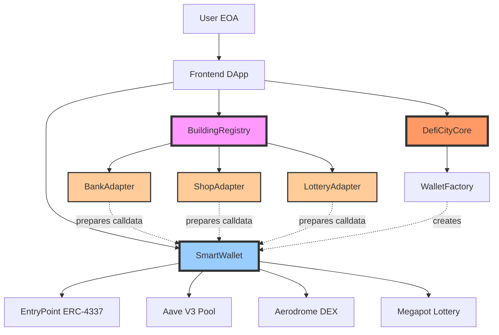

**Key Contracts:**
- **DefiCityCore**: Game logic & state tracking (NEVER holds tokens)
- **BuildingRegistry**: Routes operations to correct building adapter
- **BankAdapter**: Prepares Aave V3 interactions (supply/borrow)
- **ShopAdapter**: Prepares Aerodrome DEX LP provision
- **LotteryAdapter**: Prepares Megapot lottery ticket purchases
- **WalletFactory**: Creates SmartWallets only (no game logic)
- **SmartWallet**: User's self-custodial wallet (holds all assets)
- **EntryPoint**: ERC-4337 bundler interaction

**Adapter Pattern Benefits:**
- ✅ Modular: Each building type is independent (~300-400 lines)
- ✅ Extensible: Add new buildings without touching existing code
- ✅ Upgradeable: Hot-swap adapters independently
- ✅ Maintainable: Test and deploy each adapter separately

---

## UC-001: Create Town Hall (New Player Onboarding)

**NEW ARCHITECTURE**: Town Hall creation moved from Factory to Core

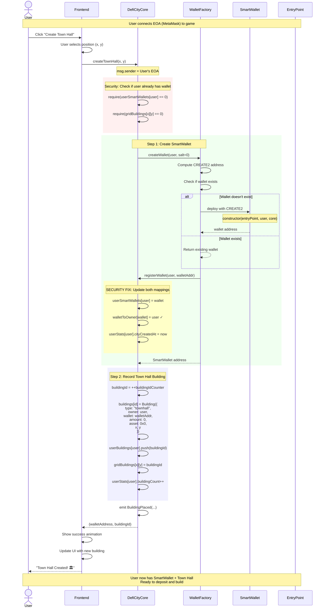

**Key Changes from Old Architecture:**
- ✅ Core handles Town Hall creation (not Factory)
- ✅ Factory only creates wallets
- ✅ Both `userSmartWallets` and `walletToOwner` mappings updated
- ✅ No UserOperation needed (direct EOA call)

---

## UC-002: Place Bank Building - Supply Mode

**Epic 4: US-011 - Supply assets to Aave and earn yield**

```mermaid
sequenceDiagram
    actor User
    participant Frontend
    participant Registry as BuildingRegistry
    participant Adapter as BankAdapter
    participant Wallet as SmartWallet
    participant Token as ERC20 (USDC)
    participant Aave as Aave V3 Pool
    participant Core as DefiCityCore

    Note over User,Core: User has deposited USDC to SmartWallet

    User->>Frontend: Select "Place Bank"
    Frontend->>Frontend: User enters:<br/>- Asset: USDC<br/>- Amount: 200 USDC<br/>- Mode: Supply Only<br/>- Position: (x, y)

    rect rgb(255, 240, 240)
        Note over Frontend,Adapter: Step 1: Encode parameters
        Frontend->>Frontend: params = abi.encode({<br/>  asset: USDC,<br/>  amount: 200e6,<br/>  x: x, y: y,<br/>  isBorrowMode: false,<br/>  borrowAsset: 0x0,<br/>  borrowAmount: 0<br/>})

        Note over Frontend,Registry: Step 2: Get calldata from Registry
        Frontend->>Registry: preparePlace(<br/>  "bank",<br/>  user,<br/>  userSmartWallet,<br/>  params<br/>)

        Registry->>Registry: adapter = adapters["bank"]
        Registry->>Registry: require(adapter != 0)

        Registry->>Adapter: preparePlace(<br/>  user,<br/>  userSmartWallet,<br/>  params<br/>)

        Note over Adapter: Decode PlaceParams
        Adapter->>Adapter: PlaceParams memory p = decode(params)
        Adapter->>Adapter: require(p.asset != 0)
        Adapter->>Adapter: require(p.amount > 0)

        Note over Adapter: Prepare batch [approve, supply, recordBuilding]

        Note over Adapter: Batch[0]: Approve Aave Pool
        Adapter->>Adapter: targets[0] = USDC<br/>datas[0] = approve(aavePool, 200e6)

        Note over Adapter: Batch[1]: Supply to Aave
        Adapter->>Adapter: targets[1] = aavePool<br/>datas[1] = supply(USDC, 200e6, wallet, 0)

        Note over Adapter: Batch[2]: Record in Core
        Adapter->>Adapter: metadata = encode("supply", 0, 0)<br/>targets[2] = core<br/>datas[2] = recordBuildingPlacement(<br/>  user, "bank", USDC, 200e6, x, y, metadata<br/>)

        Adapter-->>Registry: (targets[], values[], datas[])
        Registry-->>Frontend: (targets[], values[], datas[])
    end

    rect rgb(240, 255, 240)
        Note over Frontend,Wallet: Step 3: Execute via Session Key (gasless)
        Frontend->>Wallet: executeFromGame(targets, values, datas)
        Note over Wallet: Called by game server with session key

        rect rgb(255, 255, 200)
            Note over Wallet: SECURITY: Validate session key
            Wallet->>Wallet: require(sessionKeys[msg.sender].active)
            Wallet->>Wallet: require(now <= validUntil)
            Wallet->>Wallet: require(!paused) ✓

            Note over Wallet: Check 24-hour spending window
            Wallet->>Wallet: if (now >= windowStart + 24h):<br/>  windowStart = now<br/>  spentInWindow = 0

            Wallet->>Wallet: Check whitelisted targets
            Wallet->>Wallet: require(whitelistedTargets[target])

            Wallet->>Wallet: Calculate total USD value
            Wallet->>Wallet: require(spentInWindow + value <= dailyLimit)
            Wallet->>Wallet: spentInWindow += value ✓
        end

        Note over Wallet: Execute Batch[0]: Approve
        Wallet->>Token: approve(aavePool, 200 USDC)
        Token-->>Wallet: ✓

        Note over Wallet: Execute Batch[1]: Supply
        Wallet->>Aave: supply(USDC, 200e6, wallet, 0)
        Aave->>Token: transferFrom(wallet, aave, 200 USDC)
        Token-->>Aave: ✓
        Aave->>Aave: mint aUSDC to wallet
        Aave-->>Wallet: ✓

        Note over Wallet: Execute Batch[2]: Record Building
        Wallet->>Core: recordBuildingPlacement(<br/>  user, "bank", USDC, 200e6, x, y<br/>)

        rect rgb(255, 255, 200)
            Note over Core: SECURITY: Validate SmartWallet caller
            Core->>Core: require(walletToOwner[msg.sender] != 0) ✓
            Core->>Core: userWallet = userSmartWallets[user]
            Core->>Core: require(msg.sender == userWallet)
        end

        Core->>Core: buildingId = ++counter
        Core->>Core: buildings[id] = Building({<br/>  type: "bank",<br/>  owner: user,<br/>  wallet: msg.sender,<br/>  asset: USDC,<br/>  amount: 200e6<br/>})
        Core->>Core: userBuildings[user].push(id)
        Core->>Core: gridBuildings[x][y] = id

        Core->>Core: emit BuildingPlaced(...)
        Core-->>Wallet: buildingId

        Wallet->>Wallet: emit SessionKeyUsed(...)
        Wallet-->>Frontend: ✓
    end

    Frontend->>Frontend: Update UI with new building
    Frontend-->>User: "Bank Created!<br/>Earning ~4% APY 📊"

    Note over User,Core: Building now earning yield from Aave
```

**Adapter Pattern Benefits:**
- ✅ BankAdapter handles all Aave-specific logic
- ✅ BuildingRegistry routes "bank" to BankAdapter
- ✅ Easy to upgrade Aave integration without touching Core
- ✅ 0.05% placement fee managed by adapter

---

## UC-003: Place Bank Building - Borrow Mode

**Epic 4: US-012 - Supply collateral and borrow assets**

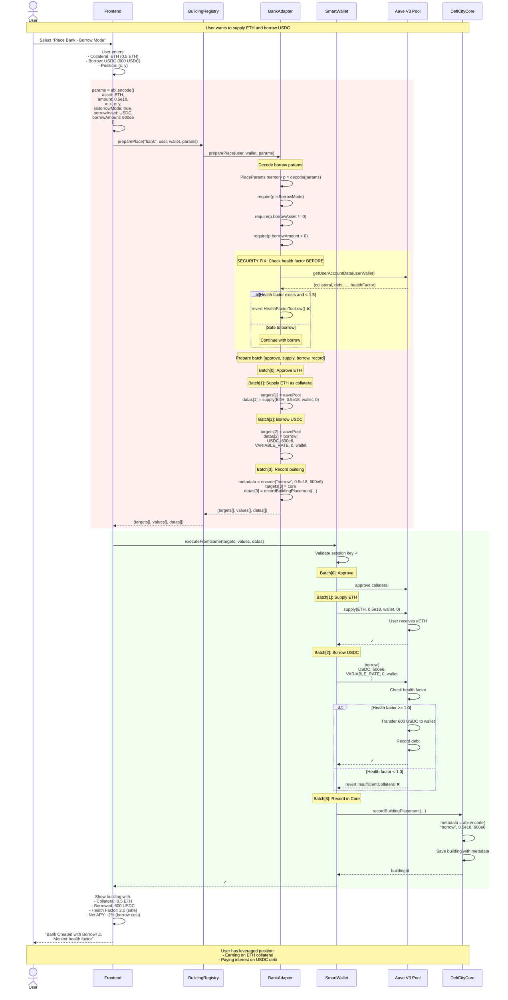

**Health Factor Management:**
- ✅ Pre-check by BankAdapter before allowing borrow
- ⚠️ Warning when HF < 1.5
- ❌ Liquidation risk when HF < 1.0
- ℹ️ User can repay anytime to improve HF

---

## UC-004: Place Shop Building - Aerodrome LP

**Epic 4: US-013 - Provide liquidity on Aerodrome DEX**

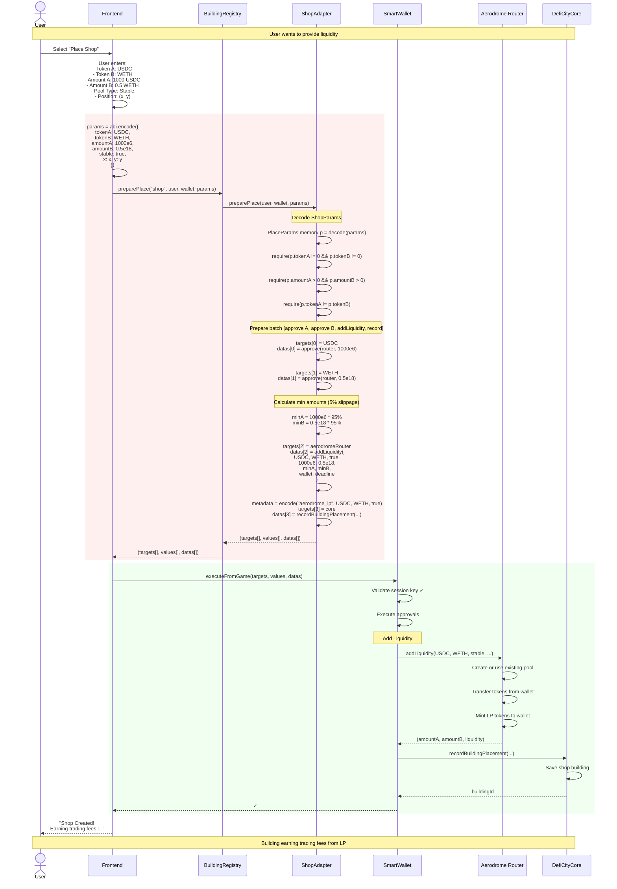

**ShopAdapter Features:**
- ✅ Handles Aerodrome DEX integration
- ✅ Supports both stable and volatile pools
- ✅ 5% slippage protection
- ✅ Records metadata for LP position tracking

---

## UC-005: Place Lottery Building - Megapot

**Epic 4: US-014 - Buy lottery tickets**

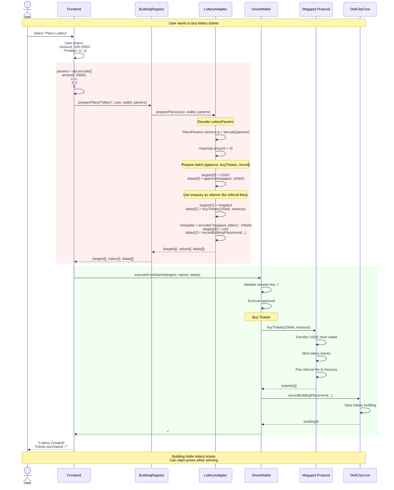

**LotteryAdapter Features:**
- ✅ USDC-only (Megapot requirement)
- ✅ Treasury as referrer (protocol earns referral fees)
- ✅ No refund on demolish (tickets stay in Megapot)
- ✅ Variable yield (based on lottery draws)

---

## UC-006: Harvest Yield from Building

**Epic 4: US-015 - Claim accumulated yield**

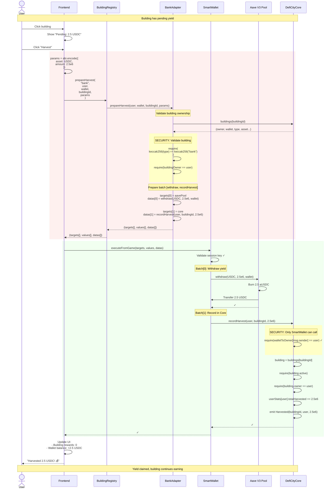

**Multi-Adapter Harvest:**
- Bank: Withdraw from Aave
- Shop: Claim trading fees + AERO rewards
- Lottery: Claim prizes from winning tickets

---

## UC-007: Demolish Building

**Remove building and withdraw all funds**

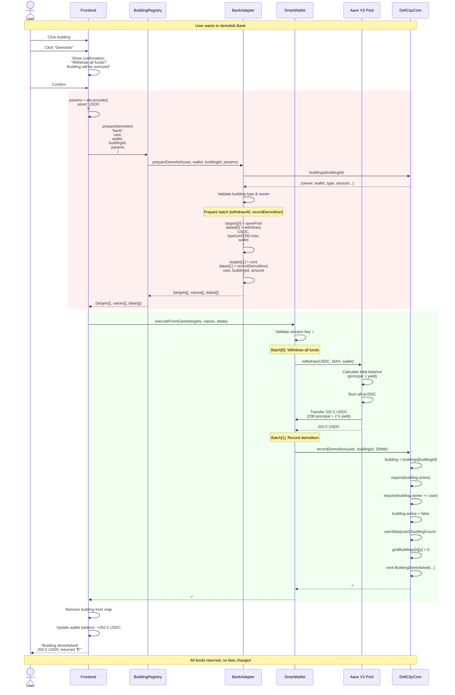

**Important Notes:**
- ✅ No demolition fees
- ✅ All funds (principal + yield) returned
- ⚠️ Town Hall cannot be demolished
- ⚠️ Bank with active borrow must repay first
- ⚠️ Lottery: tickets stay in Megapot (no refund)

---

## UC-008: Withdraw Funds to External Wallet

**Not gasless - user pays gas for external transfer**

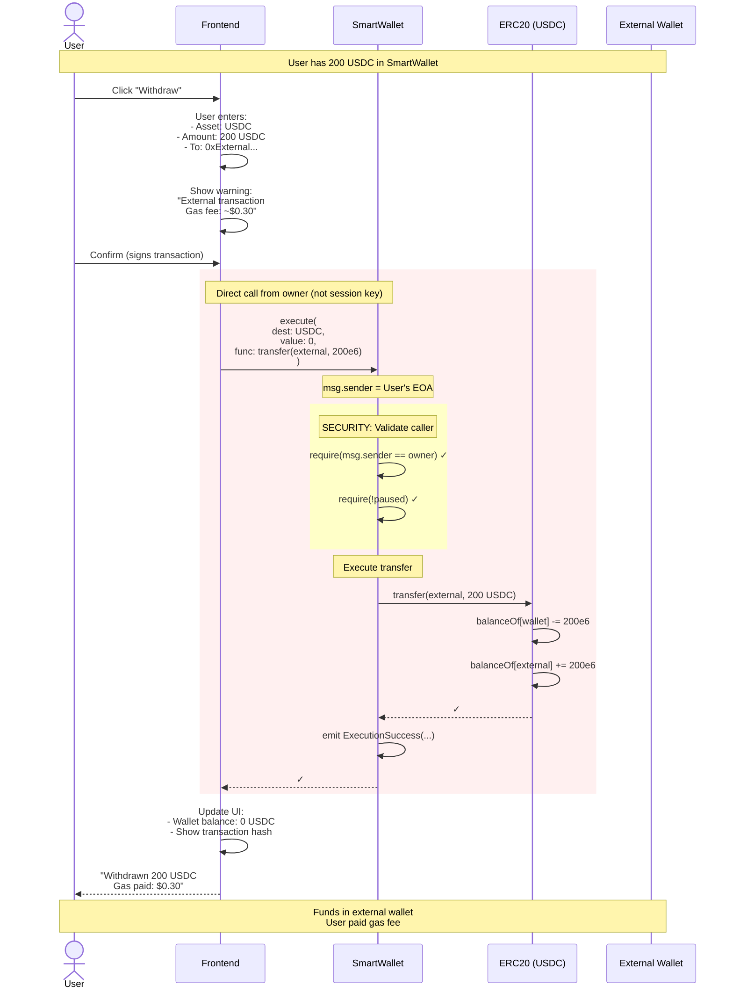

**Why User Pays Gas:**
- ❌ Not a game action (external transfer)
- ❌ Not sponsored by paymaster
- ℹ️ Direct owner call to SmartWallet
- ℹ️ Typical cost: $0.30 on Base

---

## UC-009: Session Key Management

**Epic 7: Gasless gameplay with session keys**

### 9a. Create Session Key (First Time)

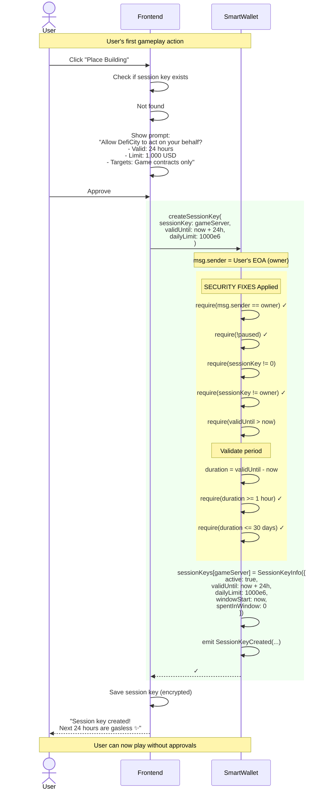

### 9b. Session Key Spending Tracking

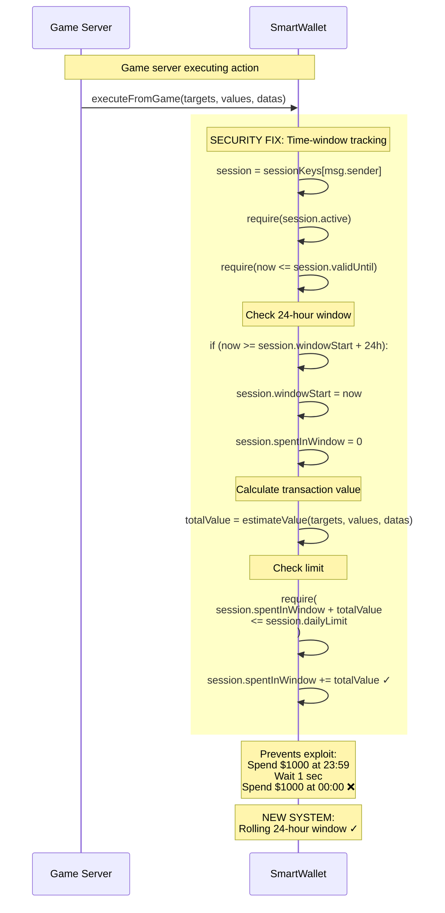

**Security Improvements:**
- ✅ Time-window instead of day-based
- ✅ Cannot set owner as session key
- ✅ Min 1 hour, max 30 days validity
- ✅ Update existing keys
- ✅ Pause mechanism

---

## Summary of Adapter Pattern Architecture

### ✅ Key Components

**1. BuildingRegistry (Central Router)**
- Routes all building operations to correct adapter
- Manages adapter registration/upgrades
- Pass-through for validation, fees, yields

**2. Building Adapters**
- **BankAdapter**: Aave V3 supply/borrow (~436 lines)
- **ShopAdapter**: Aerodrome DEX LP provision (~370 lines)
- **LotteryAdapter**: Megapot lottery tickets (~290 lines)

**3. Core Contracts**
- **DefiCityCore**: Game state & building records (no tokens)
- **SmartWallet**: User's self-custodial wallet (holds all assets)
- **WalletFactory**: Creates SmartWallets only

### 🎯 Key Flows

- **New Player**: EOA → Core.createTownHall() → Factory creates wallet → Core records building
- **Place Building**: Registry → Adapter.preparePlace() → Wallet executes via session key → DeFi protocol → Core records
- **Harvest**: Registry → Adapter.prepareHarvest() → Withdraw from protocol → Update stats
- **Demolish**: Registry → Adapter.prepareDemolish() → Withdraw all → Mark inactive
- **Withdraw**: Owner pays gas → Direct transfer to external wallet

### ✨ Adapter Pattern Benefits

**Maintainability:**
- ✅ Each adapter ~300-400 lines (vs 940+ monolithic)
- ✅ Test each adapter independently
- ✅ Deploy/upgrade adapters independently

**Extensibility:**
- ✅ Add new building types without touching existing code
- ✅ Just deploy new adapter + register
- ✅ Example: FarmAdapter (Beefy) = deploy + register("farm")

**Fee Management:**
- ✅ Each adapter manages its own fees (0.05% default)
- ✅ Easy to adjust per building type

**Protocol Integration:**
- ✅ Adapter encapsulates protocol-specific logic
- ✅ Easy to upgrade protocol integrations
- ✅ Example: Aave V3 → V4 = upgrade BankAdapter only

---

**END OF DOCUMENT**
