# DefiCity - Smart Contract Sequence Diagrams

**Version:** 2.0 (Post Security Audit Fixes)
**Date:** 2026-01-16
**Architecture:** Refactored with Security Improvements

---

## Table of Contents

1. [UC-001: Create Town Hall (New Player Onboarding)](#uc-001-create-town-hall-new-player-onboarding)
2. [UC-002: Place Bank Building - Supply Mode](#uc-002-place-bank-building---supply-mode)
3. [UC-003: Place Bank Building - Borrow Mode](#uc-003-place-bank-building---borrow-mode)
4. [UC-004: Harvest Yield from Building](#uc-004-harvest-yield-from-building)
5. [UC-005: Demolish Building](#uc-005-demolish-building)
6. [UC-006: Withdraw Funds to External Wallet](#uc-006-withdraw-funds-to-external-wallet)
7. [UC-007: Session Key Management](#uc-007-session-key-management)
8. [UC-008: Deposit More to Existing Building](#uc-008-deposit-more-to-existing-building)

---

## Architecture Overview

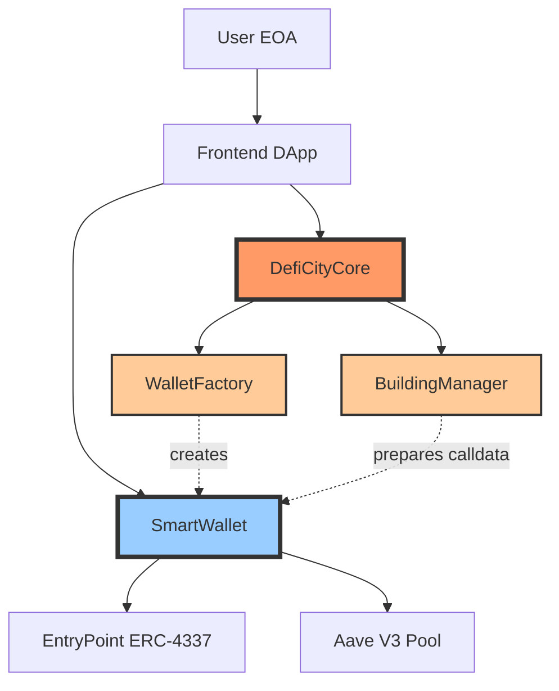

**Key Contracts:**
- **DefiCityCore**: Game logic & building management (NEVER holds tokens)
- **WalletFactory**: Creates SmartWallets only (no game logic)
- **SmartWallet**: User's self-custodial wallet (holds all assets)
- **BuildingManager**: Prepares DeFi interaction calldata
- **EntryPoint**: ERC-4337 bundler interaction

---

## UC-001: Create Town Hall (New Player Onboarding)

**NEW ARCHITECTURE**: Town Hall creation moved from Factory to Core

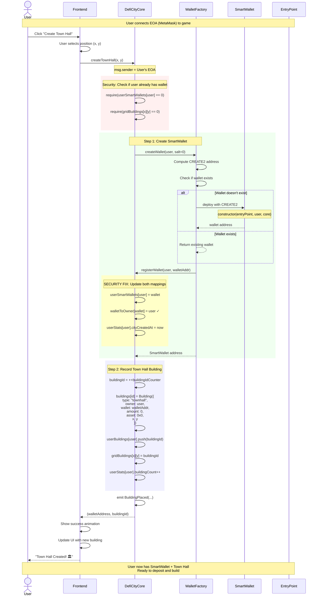

**Key Changes from Old Architecture:**
- ✅ Core handles Town Hall creation (not Factory)
- ✅ Factory only creates wallets
- ✅ Both `userSmartWallets` and `walletToOwner` mappings updated
- ✅ No UserOperation needed (direct EOA call)

---

## UC-002: Place Bank Building - Supply Mode

**Epic 4: US-011 - Supply assets to Aave and earn yield**

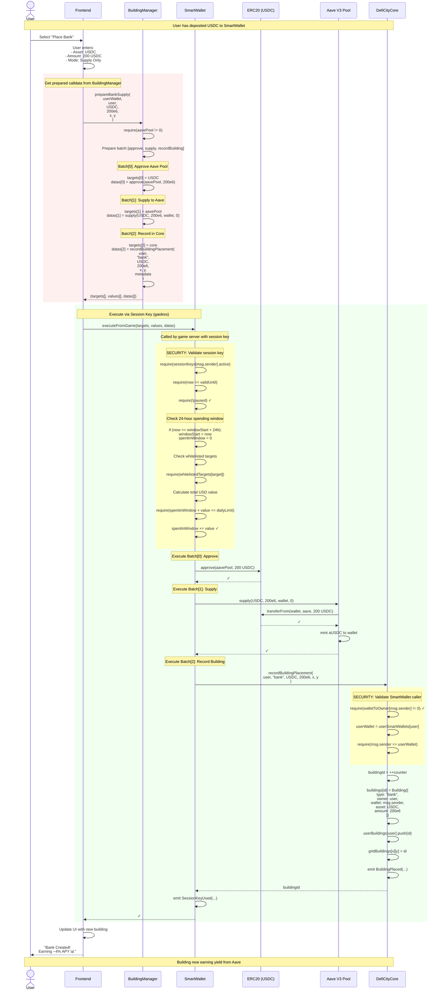

**Key Security Improvements:**
- ✅ Session key time-window tracking (not day-based)
- ✅ Pause mechanism on SmartWallet
- ✅ Proper `onlyUserWallet` modifier with reverse mapping
- ✅ Whitelisted targets validation

---

## UC-003: Place Bank Building - Borrow Mode

**Epic 4: US-012 - Supply collateral and borrow assets**

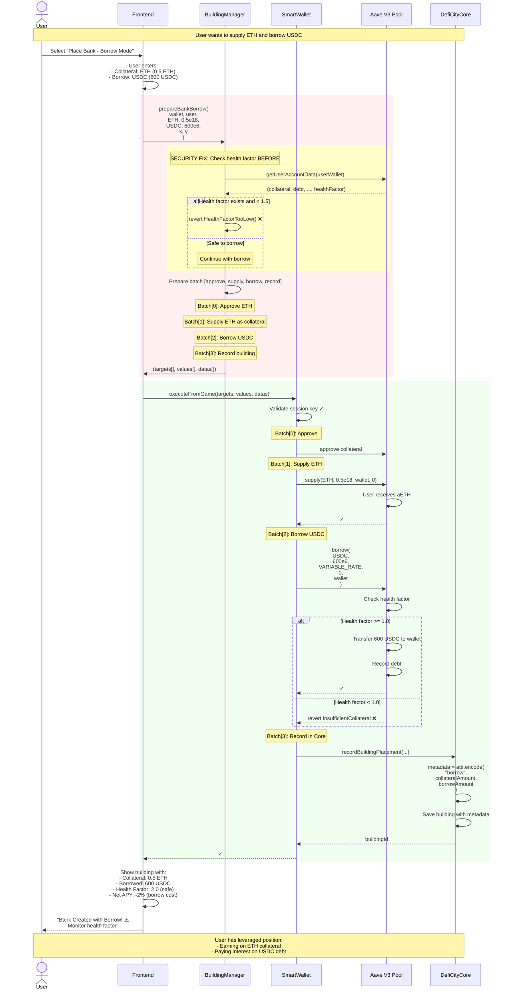

**Health Factor Management:**
- ✅ Pre-check before allowing borrow
- ⚠️ Warning when HF < 1.5
- ❌ Liquidation risk when HF < 1.0
- ℹ️ User can repay anytime to improve HF

---

## UC-004: Harvest Yield from Building

**Epic 4: US-015 - Claim accumulated yield**

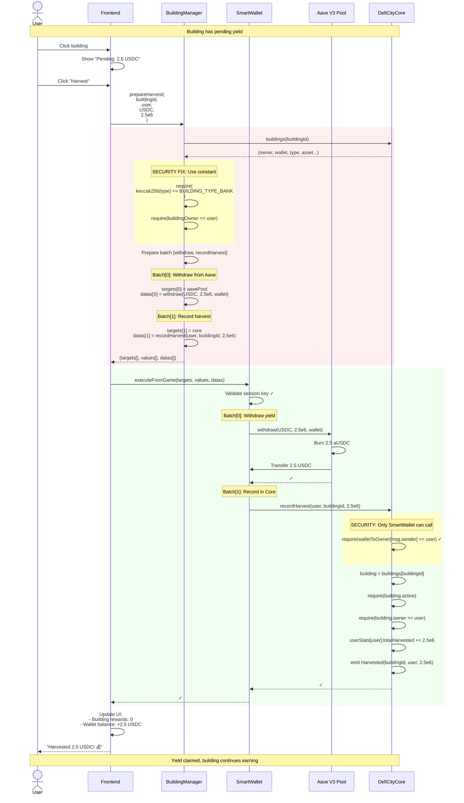

**No Fees for Harvesting:**
- ✅ Gasless via session key
- ✅ No protocol fees on harvest
- ✅ Funds go directly to user's wallet

---

## UC-005: Demolish Building

**Remove building and withdraw all funds**

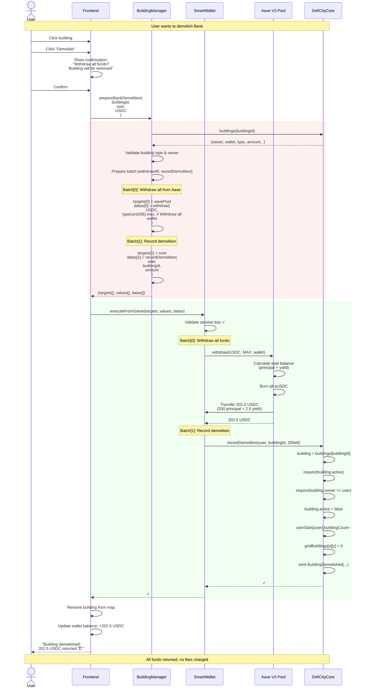

**Important Notes:**
- ✅ No demolition fees
- ✅ All funds (principal + yield) returned
- ⚠️ Town Hall cannot be demolished
- ⚠️ Bank with active borrow must repay first

---

## UC-006: Withdraw Funds to External Wallet

**Not gasless - user pays gas for external transfer**

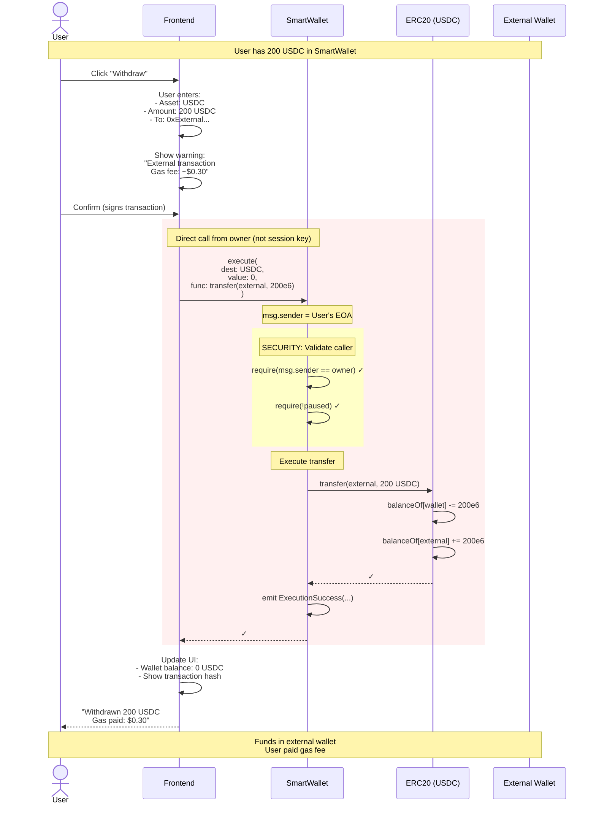

**Why User Pays Gas:**
- ❌ Not a game action (external transfer)
- ❌ Not sponsored by paymaster
- ℹ️ Direct owner call to SmartWallet
- ℹ️ Typical cost: $0.30 on Base

---

## UC-007: Session Key Management

**Epic 7: Gasless gameplay with session keys**

### 7a. Create Session Key (First Time)

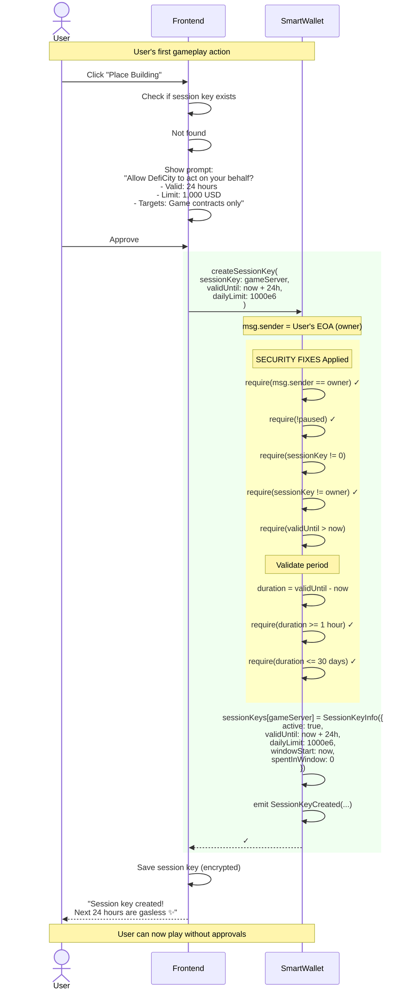

### 7b. Update Session Key

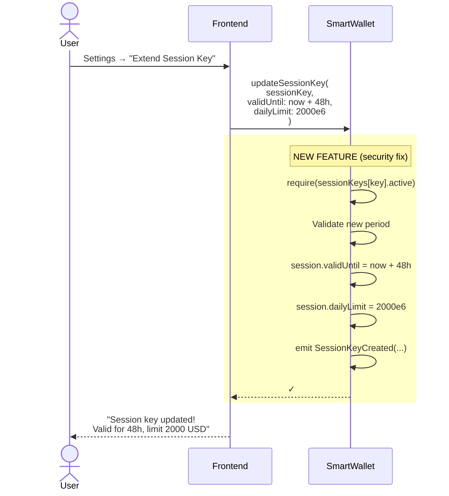

### 7c. Session Key Spending Tracking

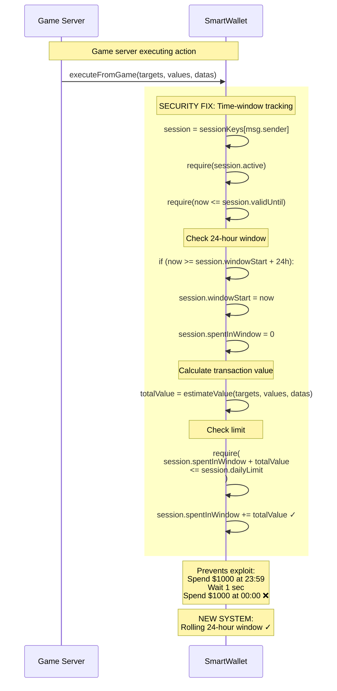

**Security Improvements:**
- ✅ Time-window instead of day-based
- ✅ Cannot set owner as session key
- ✅ Min 1 hour, max 30 days validity
- ✅ Update existing keys
- ✅ Pause mechanism

---

## UC-008: Deposit More to Existing Building

**Add funds to increase building size**

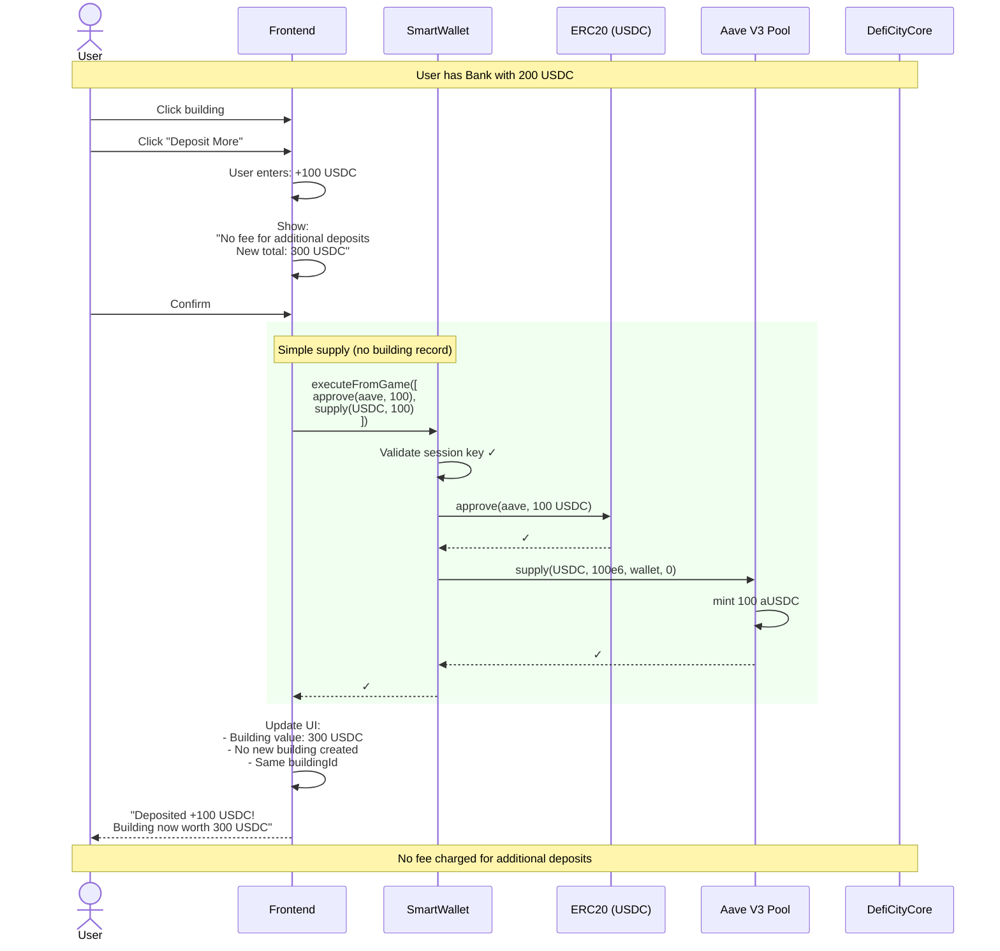

---

## Summary of Architectural Changes

### ✅ Security Fixes Implemented

1. **DefiCityCore**:
   - Fixed broken `onlyUserWallet` modifier with reverse mapping
   - Added access control to `recordDeposit/Withdrawal`
   - Moved Town Hall creation from Factory to Core
   - Added validation to all setters

2. **SmartWallet**:
   - Changed to time-window based session key tracking
   - Added min/max validity validation
   - Added `updateSessionKey()` function
   - Added emergency `pause()/unpause()`
   - Added constants for all magic numbers
   - Added `whenNotPaused` modifiers

3. **BuildingManager**:
   - Added health factor validation before borrowing
   - Removed dead code (unused protocols)
   - Added constants for building types
   - Gas-efficient string comparisons
   - Proper validation on all setters

4. **WalletFactory**:
   - Removed Town Hall logic (moved to Core)
   - Now only creates wallets
   - Cleaner separation of concerns

### 🎯 Key Flows

- **New Player**: EOA → Core.createTownHall() → Factory creates wallet → Core records building
- **Place Building**: Manager prepares calldata → Wallet executes via session key → DeFi interaction → Core records
- **Harvest**: Gasless via session key → Withdraw from protocol → Update stats
- **Withdraw**: Owner pays gas → Direct transfer to external wallet

---

**END OF DOCUMENT**
