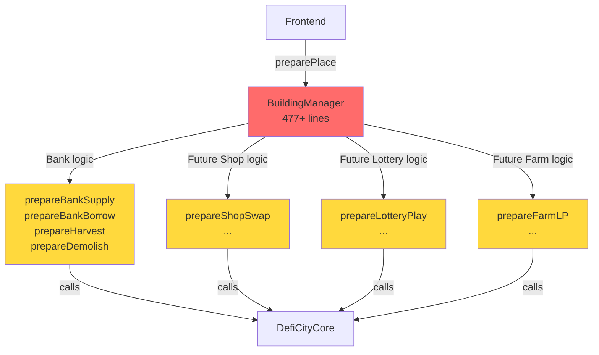
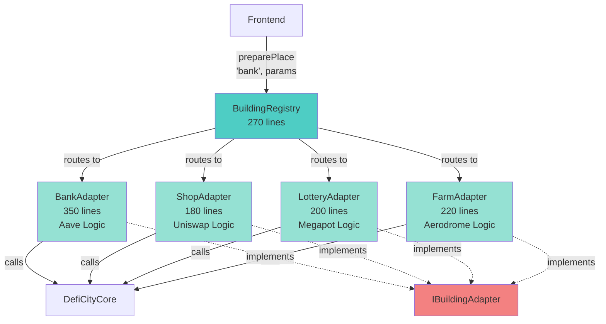
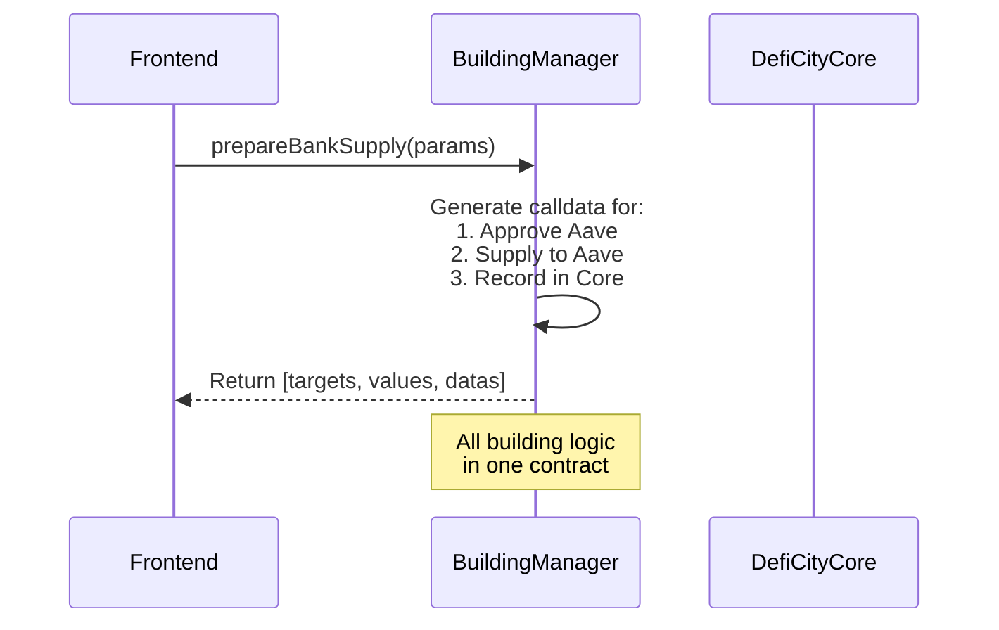
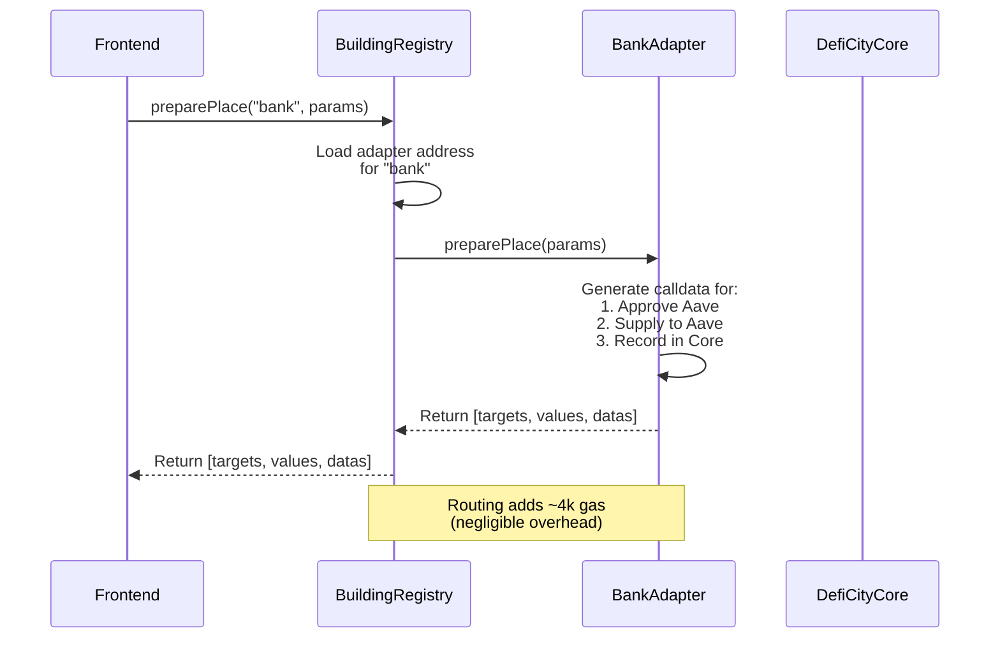
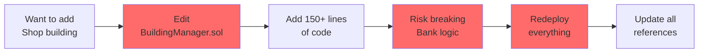
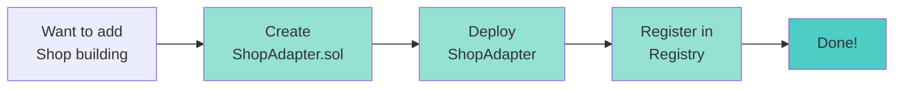
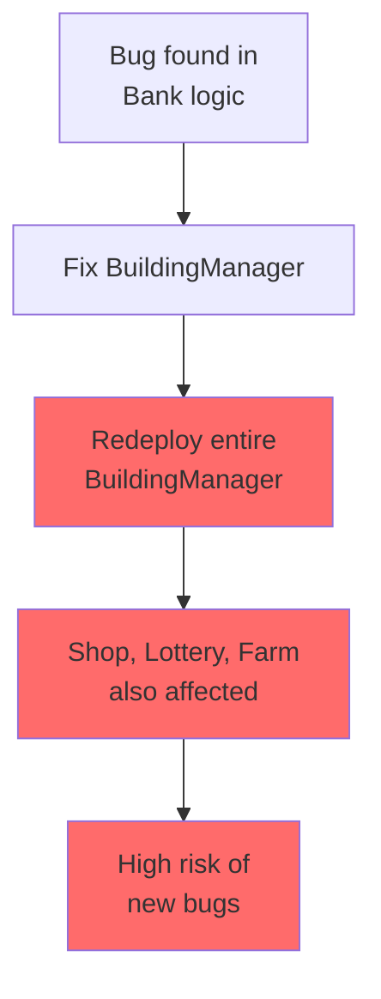
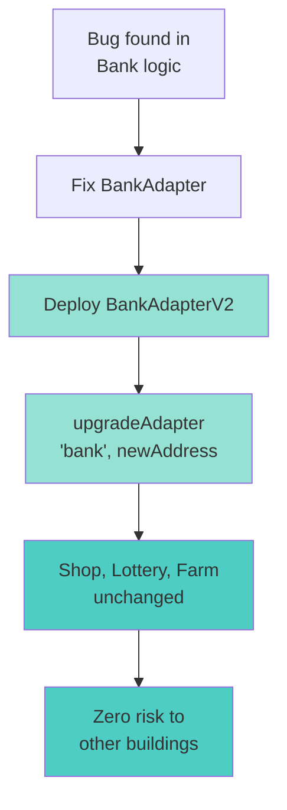
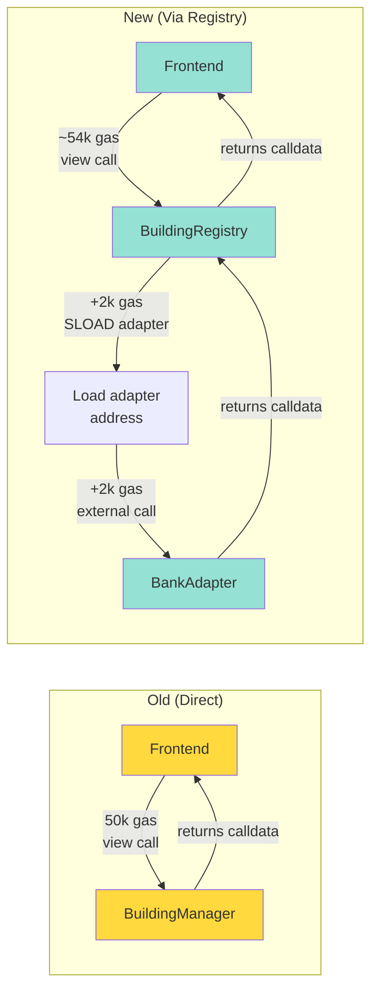

# Architecture Diagrams

## Current Architecture (Monolithic)



**Problem:** Everything in one big contract!

---

## Proposed Architecture (Adapter Pattern)



**Solution:** Clean separation, easy to maintain!

---

## Sequence Diagram: Place Bank Building

### Old Way (Monolithic)



### New Way (Adapter Pattern)



---

## Adding New Building Type

### Old Way: Edit BuildingManager ❌



### New Way: Deploy Adapter ✅



---

## Upgrade Flow

### Old Way: Risky ❌



### New Way: Safe ✅



---

## File Structure Comparison

### Before (Monolithic)

```
contracts/
├── core/
│   ├── DefiCityCore.sol
│   └── BuildingManager.sol (477 lines → 1200+ lines)
│       ├── Bank logic
│       ├── Shop logic
│       ├── Lottery logic
│       └── Farm logic
```

### After (Adapter Pattern)

```
contracts/
├── interfaces/
│   └── IBuildingAdapter.sol (standard interface)
├── core/
│   ├── DefiCityCore.sol
│   ├── BuildingManager.sol (deprecated)
│   └── BuildingRegistry.sol (270 lines)
└── adapters/
    ├── BankAdapter.sol (350 lines)
    ├── ShopAdapter.sol (180 lines)
    ├── LotteryAdapter.sol (200 lines)
    └── FarmAdapter.sol (220 lines)
```

---

## Gas Cost Breakdown



**Gas Overhead: ~4,000 gas (~8%) on view calls**
**Impact on actual execution: ~0.4% (negligible)**

---

## Summary

| Aspect | Monolithic | Adapter Pattern |
|--------|------------|-----------------|
| **Complexity** | 🟢 Simple (1 contract) | 🟡 Medium (multiple contracts) |
| **Maintainability** | 🔴 Hard (1200+ lines) | 🟢 Easy (small, focused) |
| **Scalability** | 🔴 Limited | 🟢 Unlimited |
| **Adding Buildings** | 🔴 Edit core contract | 🟢 Deploy + register |
| **Upgrading** | 🔴 Redeploy everything | 🟢 Upgrade independently |
| **Testing** | 🟡 Test all together | 🟢 Test independently |
| **Gas Cost** | 🟢 Lowest | 🟡 +0.4% overhead |
| **Risk** | 🔴 High (coupled) | 🟢 Low (isolated) |

**Recommendation: Use Adapter Pattern for 3+ building types with different logic** ✅
