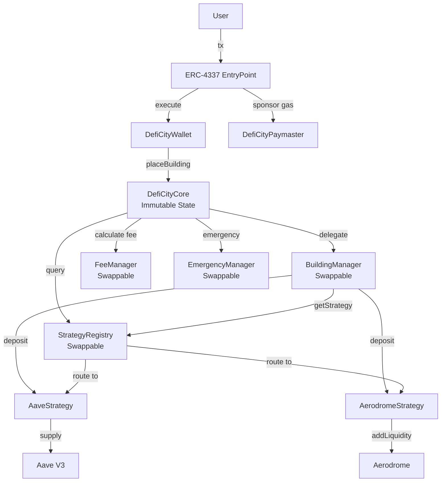

# Smart Contract Design - DefiCity

## Overview

DefiCity is a gamified DeFi portfolio management platform built on Base with a **modular architecture without proxy**.

**Version:** 1.0
**Chain:** Base (L2)
**Solidity:** 0.8.24
**Account Abstraction:** ERC-4337
**Architecture:** Modular + Registry (No Proxy)

---

## Table of Contents

1. [Architecture Overview](#architecture-overview)
2. [Design Philosophy](#design-philosophy)
3. [Contract Details](#contract-details)
4. [Data Structures](#data-structures)
5. [Function Flows](#function-flows)
6. [Security Considerations](#security-considerations)
7. [Upgrade Strategy](#upgrade-strategy)
8. [Gas Optimization](#gas-optimization)
9. [Testing Strategy](#testing-strategy)
10. [Deployment](#deployment)

---

## Architecture Overview

### Design Philosophy

```
✅ Immutable Core = State Storage (Trustless)
✅ Swappable Modules = Logic Layers (Upgradeable)
✅ No Proxy = No delegatecall overhead
✅ Registry Pattern = Dynamic routing
✅ Emergency Mechanisms = Pause + Emergency withdraw
```

### High-Level Architecture

```
┌─────────────────────────────────────────────────────────────┐
│                      USER LAYER                             │
│  ┌──────────────┐  ┌──────────────┐  ┌──────────────┐     │
│  │   MetaMask   │  │    Email     │  │   Passkey    │     │
│  └──────┬───────┘  └──────┬───────┘  └──────┬───────┘     │
│         └──────────────────┴──────────────────┘             │
└─────────────────────────┬───────────────────────────────────┘
                          │
                          ▼
┌─────────────────────────────────────────────────────────────┐
│                 ACCOUNT ABSTRACTION                         │
│  ┌─────────────────────────────────────────────────────┐   │
│  │             ERC-4337 EntryPoint                      │   │
│  └──────────────────────┬──────────────────────────────┘   │
│           ┌─────────────┴────────────┐                      │
│           ▼                          ▼                      │
│  ┌───────────────┐         ┌──────────────────┐            │
│  │ DefiCityWallet│         │DefiCityPaymaster │            │
│  │ (UUPS Upgrade)│         │ (Gas Sponsor)    │            │
│  └───────┬───────┘         └──────────────────┘            │
└──────────┼──────────────────────────────────────────────────┘
           │
           ▼
┌─────────────────────────────────────────────────────────────┐
│              CORE LAYER (Immutable State)                   │
│  ┌─────────────────────────────────────────────────────┐   │
│  │           DefiCityCore (State Storage)            │   │
│  │  • User cities & buildings                           │   │
│  │  • Building type configs                             │   │
│  │  • Module coordination                               │   │
│  └──────────────────────┬──────────────────────────────┘   │
└─────────────────────────┼───────────────────────────────────┘
                          │
            ┌─────────────┼─────────────┐
            │             │             │
            ▼             ▼             ▼
┌─────────────────────────────────────────────────────────────┐
│              LOGIC MODULES (Swappable)                      │
│  ┌──────────────┐ ┌────────────────┐ ┌──────────────┐     │
│  │  Strategy    │ │  Building      │ │    Fee       │     │
│  │  Registry    │ │  Manager       │ │  Manager     │     │
│  └──────┬───────┘ └────────────────┘ └──────────────┘     │
│         │                                                   │
│         │ (Dynamic Lookup)                                 │
│         │                                                   │
│  ┌──────┴────────────┐          ┌────────────────┐        │
│  │                   │          │   Emergency    │        │
│  ▼                   ▼          │    Manager     │        │
└─────────────────────────────────────────────────────────────┘
           │             │         └────────────────┘
           ▼             ▼
┌─────────────────────────────────────────────────────────────┐
│                  STRATEGY LAYER                             │
│  ┌────────────────┐              ┌────────────────┐        │
│  │   Aave         │              │  Aerodrome     │        │
│  │ Strategy V1    │              │  Strategy V1   │        │
│  └──────┬─────────┘              └──────┬─────────┘        │
└─────────┼────────────────────────────────┼──────────────────┘
          │                                │
          ▼                                ▼
┌─────────────────────────────────────────────────────────────┐
│                   PROTOCOL LAYER                            │
│  ┌────────────────┐              ┌────────────────┐        │
│  │   Aave V3      │              │   Aerodrome    │        │
│  │   (Base)       │              │   (Base)       │        │
│  └────────────────┘              └────────────────┘        │
└─────────────────────────────────────────────────────────────┘
```

### Contract Relationships



---

## Design Philosophy

### Why No Proxy?

| Aspect | With Proxy (UUPS/Transparent) | Modular (No Proxy) |
|--------|-------------------------------|----------------------|
| **Gas Cost** | ~280k (place building) | ~220k |
| **Complexity** | High (storage slots, delegatecall) | Medium (module coordination) |
| **Security Risks** | Storage collision, delegatecall bugs | Module misconfiguration |
| **Upgrade Flexibility** | Full (can change anything) | Modular (logic only) |
| **Trustlessness** | Medium (admin can change logic) | High (state immutable) |
| **Audit Cost** | $80k-100k | $40k-60k |

### Architecture Benefits

✅ **No Proxy Overhead**: Direct calls = lower gas
✅ **Trustless Core**: User state never changes
✅ **Modular Upgradeability**: Swap logic modules
✅ **Clear Separation**: State vs Logic
✅ **Emergency Ready**: Pause + Emergency withdraw

---

## Contract Details

### 1. DefiCityCore (Immutable)

**File:** `src/DefiCityCore.sol`

**Purpose:** Core state storage and module coordination

**Responsibilities:**
- Store user cities & buildings
- Store building type configs
- Coordinate module calls
- Handle USDC transfers
- Emergency pause

**Key State:**
```solidity
mapping(address => UserCity) private _cities;
mapping(uint256 => BuildingTypeConfig) private _buildingTypes;

IStrategyRegistry public strategyRegistry;    // Swappable
IBuildingManager public buildingManager;      // Swappable
IFeeManager public feeManager;                // Swappable
IEmergencyManager public emergencyManager;    // Swappable
```

**Critical Functions:**

| Function | Access | Gas | Description |
|----------|--------|-----|-------------|
| `placeBuilding()` | External | ~220k | Create building, delegate to manager |
| `deposit()` | External | ~150k | Add funds to building |
| `harvest()` | External | ~100k | Claim yield |
| `demolish()` | External | ~180k | Destroy building, withdraw funds |
| `emergencyWithdraw()` | External (when paused) | ~200k | Emergency withdrawal |
| `updateStrategyRegistry()` | Owner | ~50k | Swap registry module |
| `updateBuildingManager()` | Owner | ~50k | Swap building logic |
| `pause()` | Owner | ~30k | Emergency pause |

**Design Pattern:**
```solidity
// Core coordinates, modules execute
function placeBuilding(uint256 buildingType, uint256 amount) external {
    // 1. Accept USDC
    USDC.safeTransferFrom(msg.sender, address(this), amount);

    // 2. Delegate to BuildingManager
    uint256 shares = buildingManager.placeBuilding(msg.sender, buildingType, amount);

    // 3. Store state in Core
    _cities[msg.sender].buildings[id] = Building({
        buildingType: buildingType,
        shares: shares,
        ...
    });
}
```

---

### 2. StrategyRegistry (Swappable)

**File:** `src/StrategyRegistry.sol`

**Purpose:** Map building types to DeFi strategies

**Key Features:**
- Dynamic strategy routing
- Version history tracking
- Strategy deprecation
- Owner-controlled updates

**State:**
```solidity
mapping(uint256 => address) private _activeStrategy;           // buildingType → strategy
mapping(uint256 => StrategyVersion[]) private _strategyHistory; // Version history
mapping(address => StrategyInfo) private _strategyInfo;         // Strategy metadata
```

**Key Functions:**

| Function | Access | Description |
|----------|--------|-------------|
| `registerStrategy()` | Owner | Register new strategy |
| `setStrategy()` | Owner | Activate strategy for building type |
| `getStrategy()` | View | Get current strategy for type |
| `deprecateStrategy()` | Owner | Mark strategy as deprecated |

**Usage Example:**
```solidity
// Deploy new strategy
AaveStrategyV2 newStrategy = new AaveStrategyV2(...);

// Register
registry.registerStrategy(address(newStrategy), "Aave V2", "v2.0.0");

// Activate for Bank building (type 1)
registry.setStrategy(1, address(newStrategy));

// ✅ All new Bank buildings use V2 strategy
// ⚠️ Old buildings still use V1 (require manual migration)
```

---

### 3. BuildingManager (Swappable)

**File:** `src/BuildingManager.sol`

**Purpose:** Handle building operation logic

**Responsibilities:**
- Validate building placement
- Calculate and collect fees
- Deposit to strategies
- Handle harvest/demolish logic

**Dependencies:**
- StrategyRegistry (to get strategies)
- FeeManager (to calculate fees)
- Core (to validate configs)

**Key Functions:**

| Function | Caller | Description |
|----------|--------|-------------|
| `placeBuilding()` | Core | Validate, fee, deposit to strategy |
| `deposit()` | Core | Add more funds to building |
| `harvest()` | Core | Claim rewards from strategy |
| `demolish()` | Core | Withdraw all from strategy |

**Logic Flow:**
```solidity
function placeBuilding(address user, uint256 buildingType, uint256 amount)
    external
    returns (uint256 shares)
{
    // 1. Validate
    BuildingTypeConfig memory config = core.getBuildingTypeConfig(buildingType);
    require(config.isActive && amount >= config.minDeposit);

    // 2. Calculate fee
    (uint256 netAmount, uint256 fee) = feeManager.calculateBuildingFee(amount);

    // 3. Collect fee
    if (fee > 0) feeManager.collectFee(fee);

    // 4. Get strategy and deposit
    IStrategy strategy = strategyRegistry.getStrategy(buildingType);
    shares = strategy.deposit(netAmount);

    // 5. Return shares to Core for storage
    return shares;
}
```

---

### 4. FeeManager (Swappable)

**File:** `src/FeeManager.sol`

**Purpose:** Calculate and collect fees

**Fee Structure:**
- Building Creation: 0.05% (5 BPS) default
- Max Fee: 5% (500 BPS)
- Deposit/Harvest/Demolish: 0% (free)

**Key Functions:**

| Function | Access | Description |
|----------|--------|-------------|
| `calculateBuildingFee()` | View | Calculate net amount and fee |
| `collectFee()` | External | Transfer fee to treasury |
| `setBuildingFee()` | Owner | Update fee (max 5%) |
| `setTreasury()` | Owner | Update treasury address |

**Example:**
```solidity
// User deposits 1000 USDC
(uint256 net, uint256 fee) = feeManager.calculateBuildingFee(1000e6);
// net = 999.5 USDC (goes to strategy)
// fee = 0.5 USDC (goes to treasury)
```

---

### 5. EmergencyManager (Swappable)

**File:** `src/EmergencyManager.sol`

**Purpose:** Handle emergency withdrawals when Core is paused

**Trigger Scenarios:**
- Strategy contract compromised
- Protocol integration issue
- Core bug discovered

**Key Functions:**

| Function | Caller | When | Description |
|----------|--------|------|-------------|
| `emergencyWithdraw()` | Core | When paused | Bypass normal checks, force withdraw |

**Safety:**
- Only works when Core.paused() == true
- Only callable by Core
- Calls strategy.emergencyWithdraw()
- Deactivates building after withdrawal

---

### 6. Strategy Contracts

**Files:**
- `src/strategies/AaveStrategy.sol`
- `src/strategies/AerodromeStrategy.sol`

**Strategy Interface:**
```solidity
interface IStrategy {
    function deposit(uint256 amount) external returns (uint256 shares);
    function withdraw(address user, uint256 shares) external returns (uint256 amount);
    function harvest(address user) external returns (uint256 earned);
    function emergencyWithdraw(address user, uint256 shares) external returns (uint256 amount);

    function balanceOf(address user) external view returns (uint256);
    function pendingRewards(address user) external view returns (uint256);
    function getAPY() external view returns (uint256);
}
```

**Key Features:**
- `withdraw()` takes `user` parameter for proper accounting
- `harvest()` takes `user` parameter for reward distribution
- `emergencyWithdraw()` for emergency situations

---

## Data Structures

### Building

```solidity
struct Building {
    uint256 buildingType;       // 0=Town Hall, 1=Bank, 2=Shop
    uint256 depositedAmount;    // Original deposit
    uint256 shares;             // Strategy shares owned
    uint256 createdAt;          // Creation timestamp
    uint256 lastHarvestAt;      // Last harvest timestamp
    bool isActive;              // Is building active?
}
```

### BuildingTypeConfig

```solidity
struct BuildingTypeConfig {
    string name;                // "Bank", "Shop"
    uint256 minDeposit;         // Minimum deposit (e.g., 100 USDC)
    uint256 maxPerUser;         // Max buildings per user (e.g., 10)
    bool isActive;              // Is this type enabled?
    bool canDemolish;           // Can be demolished?
}
```

### UserCity

```solidity
struct UserCity {
    uint256 totalBuildings;     // Number of buildings
    uint256 totalDeposited;     // Total USDC deposited
    uint256 totalEarned;        // Total yield earned
    uint256 level;              // Player level
    mapping(uint256 => Building) buildings;
}
```

---

## Function Flows

### 1. Place Building

```
User
  │
  │ 1. Approve USDC to Core
  ├──────────────────────────────────────────┐
  │                                          │
  │ 2. placeBuilding(1, 1000 USDC)          │
  └──────────────▶ DefiCityCore           │
                   │                         │
                   │ 3. Transfer USDC        │
                   │                         │
                   │ 4. Approve to BuildingMgr
                   │                         │
                   │ 5. placeBuilding()      │
                   └──────────▶ BuildingManager
                                │            │
                                │ 6. getStrategy()
                                ├──────────▶ Registry
                                │            │
                                │◀───────────┘ AaveStrategy address
                                │            │
                                │ 7. Calculate fee (0.5 USDC)
                                ├──────────▶ FeeManager
                                │            │
                                │ 8. Collect fee → Treasury
                                │            │
                                │ 9. deposit(999.5 USDC)
                                └──────────▶ AaveStrategy
                                             │
                                             │ 10. supply() to Aave
                                             └──────────▶ Aave Pool
                                                          │
                   ◀──────────────────────────────────────┘
                   │ 11. Store shares in Core
                   │
  ◀────────────────┘ 12. Emit BuildingPlaced
```

### 2. Upgrade Strategy

```
Owner
  │
  │ 1. Deploy AaveStrategyV2
  └──────────▶ AaveStrategyV2.sol deployed
               │
  │ 2. Register strategy
  └──────────▶ StrategyRegistry
               │  registerStrategy(v2Addr, "Aave V2", "v2.0.0")
               │
  │ 3. Activate for building type 1
  └──────────▶ StrategyRegistry
               │  setStrategy(1, v2Addr)
               │
               ├─▶ Update _activeStrategy[1] = v2Addr
               ├─▶ Add to history
               └─▶ Emit StrategyActivated

// ✅ New buildings use V2
// ⚠️ Old buildings still use V1

User (optional migration)
  │
  │ 4. Demolish old building
  └──────────▶ Core.demolish(0)  // Uses V1 strategy
               │
  │ 5. Place new building
  └──────────▶ Core.placeBuilding(1, amount)  // Uses V2 strategy
```

### 3. Emergency Pause & Withdraw

```
Owner detects issue
  │
  │ 1. Pause core
  └──────────▶ Core.pause()
               │
               └─▶ _paused = true

User needs to withdraw
  │
  │ 2. emergencyWithdraw(buildingId)
  └──────────▶ DefiCityCore
               │
               │ (check paused = true)
               │
               │ 3. emergencyWithdraw()
               └──────────▶ EmergencyManager
                            │
                            │ 4. getStrategy()
                            ├──────────▶ StrategyRegistry
                            │            │
                            │◀───────────┘
                            │
                            │ 5. emergencyWithdraw()
                            └──────────▶ Strategy
                                         │
                                         │ 6. Force withdraw
                                         │    (bypass checks)
                                         │
                            ◀────────────┘
                            │ 7. Deactivate building
                            │
               ◀────────────┘
               │ 8. Transfer USDC to user
               │
  ◀────────────┘ Funds returned
```

---

## Security Considerations

### Access Control

| Contract | Critical Functions | Protection |
|----------|-------------------|------------|
| DefiCityCore | Update modules, pause | `onlyOwner` (Ownable2Step) |
| StrategyRegistry | Register/set strategies | `onlyOwner` |
| BuildingManager | Update registry/fee manager | `onlyOwner` |
| FeeManager | Set fee, set treasury | `onlyOwner` |
| EmergencyManager | Emergency withdraw | `onlyCore` |

### Module Coordination

**Risk:** BuildingManager calls wrong strategy

**Mitigation:**
- Registry validates strategy exists
- Strategy implements IStrategy interface
- BuildingManager checks return values

**Risk:** Fee calculation overflow

**Mitigation:**
- Fee capped at 5% (500 BPS)
- SafeMath operations (Solidity 0.8.24+)
- FeeManager validates inputs

### Emergency Mechanisms

**Pause:**
- Owner can pause Core
- Blocks: placeBuilding, deposit, harvest, demolish
- Allows: emergencyWithdraw only

**Emergency Withdraw:**
- Only when paused
- Bypasses normal strategy checks
- Direct withdrawal from protocol
- Deactivates building to prevent double-withdraw

### Reentrancy Protection

All state-changing functions use `nonReentrant`:
- ✅ placeBuilding()
- ✅ deposit()
- ✅ harvest()
- ✅ demolish()
- ✅ emergencyWithdraw()

### Known Risks

| Risk | Severity | Mitigation |
|------|----------|------------|
| Module misconfiguration | 🔴 High | Multi-sig owner, timelock planned |
| Strategy upgrade disrupts users | 🟡 Medium | Communication + migration tools |
| Core bug (immutable) | 🔴 High | Thorough testing + audit |
| Registry points to malicious strategy | 🔴 High | Owner validation + timelock |

---

## Upgrade Strategy

### Architecture: Modular (No Proxy)

**Upgradeable:**
- ✅ StrategyRegistry (deploy new, update in Core)
- ✅ BuildingManager (deploy new, update in Core)
- ✅ FeeManager (deploy new, update in Core)
- ✅ EmergencyManager (deploy new, update in Core)
- ✅ Strategies (register new version in Registry)

**Immutable:**
- ❌ DefiCityCore (state storage)
- ✅ DefiCityWallet (UUPS upgradeable)
- ❌ DefiCityPaymaster

### How to Upgrade Components

#### Upgrade Strategy (Easy ⭐)

```bash
# 1. Deploy new strategy
forge create AaveStrategyV2 --constructor-args ...

# 2. Register in registry
cast send $REGISTRY "registerStrategy(address,string,string)" \
  $NEW_STRATEGY "Aave V2" "v2.0.0"

# 3. Activate
cast send $REGISTRY "setStrategy(uint256,address)" 1 $NEW_STRATEGY

# ✅ Done - new buildings use V2
```

#### Upgrade BuildingManager (Medium ⭐⭐)

```bash
# 1. Deploy new manager
forge create BuildingManagerV2 --constructor-args $CORE $REGISTRY $FEE_MGR

# 2. Update in Core
cast send $CORE "updateBuildingManager(address)" $NEW_MANAGER

# ✅ Done - new logic applies immediately
```

#### Upgrade Core (Hard ⭐⭐⭐⭐)

```bash
# Only if critical bug in Core (rare)
# 1. Pause old core
cast send $OLD_CORE "pause()"

# 2. Deploy new core
forge create DefiCityCore_1 --constructor-args ...

# 3. Migrate user data (script)
node scripts/migrate-to-new-core.js

# 4. Update frontend
# 5. Communicate to users
```

---

## Gas Optimization

### Strategies Used

1. **No Proxy Overhead**: Save ~60k gas per tx vs UUPS
2. **Immutable Variables**: Registry, modules stored as immutable
3. **Packed Storage**: Building struct optimized
4. **Custom Errors**: Replace require strings
5. **Via IR**: Enabled for better optimization

### Gas Estimates

| Operation | No Proxy | With Proxy | Savings |
|-----------|----------|------------|---------|
| Place Building (Aave) | 220k | 280k | -21% |
| Place Building (Aerodrome) | 420k | 480k | -12.5% |
| Deposit | 160k | 210k | -24% |
| Harvest | 110k | 150k | -27% |
| Demolish | 190k | 240k | -21% |

**Breakdown:**
```
Overhead sources:
- External calls to modules: ~20k
- Strategy registry lookup: ~5k
- Fee manager calculation: ~5k
- Additional validations: ~10k

Total overhead: ~40k

Saves 60k compared to proxy delegatecall!
```

---

## Testing Strategy

### Unit Tests

```bash
forge test -vv
```

**Coverage:**
- ✅ DefiCityCore: All functions
- ✅ StrategyRegistry: Register, set, deprecate
- ✅ BuildingManager: Place, deposit, harvest, demolish
- ✅ FeeManager: Calculate, collect
- ✅ EmergencyManager: Emergency withdraw
- ✅ Access control
- ✅ Edge cases

### Integration Tests

```bash
forge test --fork-url $BASE_RPC_URL -vvv
```

**Scenarios:**
- ✅ End-to-end place → deposit → harvest → demolish
- ✅ Strategy upgrade mid-game
- ✅ Emergency pause → withdraw
- ✅ Module swap
- ✅ Multi-user concurrent operations

### Upgrade Tests

```solidity
function testUpgradeStrategy() public {
    // 1. Place building with V1
    // 2. Deploy V2
    // 3. Update registry
    // 4. Place new building with V2
    // 5. Verify both work correctly
}

function testModuleSwap() public {
    // 1. Place building
    // 2. Deploy new BuildingManager
    // 3. Update in Core
    // 4. Verify operations still work
}
```

---

## Deployment

### Deployment Order

```bash
# 1. Deploy USDC (testnet only)
USDC=0x...

# 2. Deploy StrategyRegistry
REGISTRY=$(forge create StrategyRegistry)

# 3. Deploy FeeManager
FEE_MGR=$(forge create FeeManager --constructor-args $USDC $TREASURY)

# 4. Deploy BuildingManager (temp Core address)
BUILD_MGR=$(forge create BuildingManager --constructor-args \
  0x0000000000000000000000000000000000000000 $REGISTRY $FEE_MGR $USDC)

# 5. Deploy EmergencyManager (temp Core address)
EMERG_MGR=$(forge create EmergencyManager --constructor-args \
  0x0000000000000000000000000000000000000000 $REGISTRY)

# 6. Deploy Core
CORE=$(forge create DefiCityCore --constructor-args \
  $USDC $REGISTRY $BUILD_MGR $FEE_MGR)

# 7. Update Core address in managers
cast send $BUILD_MGR "transferOwnership(address)" $OWNER
cast send $EMERG_MGR "transferOwnership(address)" $OWNER

# 8. Update EmergencyManager in Core
cast send $CORE "updateEmergencyManager(address)" $EMERG_MGR

# 9. Deploy Strategies
AAVE_STRAT=$(forge create AaveStrategy --constructor-args ...)
AERO_STRAT=$(forge create AerodromeStrategy --constructor-args ...)

# 10. Register Strategies
cast send $REGISTRY "registerStrategy(address,string,string)" \
  $AAVE_STRAT "Aave V1" "v1.0.0"
cast send $REGISTRY "registerStrategy(address,string,string)" \
  $AERO_STRAT "Aerodrome V1" "v1.0.0"

# 11. Activate Strategies
cast send $REGISTRY "setStrategy(uint256,address)" 1 $AAVE_STRAT
cast send $REGISTRY "setStrategy(uint256,address)" 2 $AERO_STRAT

# 12. Add Building Types
cast send $CORE "addBuildingType(string,uint256,uint256,bool)" \
  "Town Hall" 0 1 false
cast send $CORE "addBuildingType(string,uint256,uint256,bool)" \
  "Bank" 100000000 10 true    # 100 USDC
cast send $CORE "addBuildingType(string,uint256,uint256,bool)" \
  "Shop" 500000000 5 true     # 500 USDC
```

### Post-Deployment Checklist

- [ ] Verify all contracts on Basescan
- [ ] Test place building on each type
- [ ] Test deposit, harvest, demolish
- [ ] Test module updates (on testnet)
- [ ] Test emergency pause/withdraw
- [ ] Fund Paymaster with ETH
- [ ] Setup multisig as owner
- [ ] Monitor for 48 hours

---

## Appendix

### Contract Addresses

#### Base Sepolia (Testnet)
```
DefiCityCore: TBD
StrategyRegistry: TBD
BuildingManager: TBD
FeeManager: TBD
EmergencyManager: TBD
AaveStrategy: TBD
AerodromeStrategy: TBD
```

#### Base Mainnet
```
DefiCityCore: TBD
StrategyRegistry: TBD
BuildingManager: TBD
FeeManager: TBD
EmergencyManager: TBD
AaveStrategy: TBD
AerodromeStrategy: TBD
```

### External Dependencies

| Protocol | Address | Chain |
|----------|---------|-------|
| Aave Pool | `0xA238Dd80C259a72e81d7e4664a9801593F98d1c5` | Base |
| USDC | `0x833589fCD6eDb6E08f4c7C32D4f71b54bdA02913` | Base |
| aUSDC | `0x4e65fE4DbA92790696d040ac24Aa414708F5c0AB` | Base |
| Aerodrome Router | `0xcF77a3Ba9A5CA399B7c97c74d54e5b1Beb874E43` | Base |
| Aerodrome Voter | `0x16613524e02ad97eDfeF371bC883F2F5d6C480A5` | Base |
| AERO Token | `0x940181a94A35A4569E4529A3CDfB74e38FD98631` | Base |
| WETH | `0x4200000000000000000000000000000000000006` | Base |
| EntryPoint | `0x5FF137D4b0FDCD49DcA30c7CF57E578a026d2789` | Base |

---

**Last Updated:** 2026-01-14
**Version:** 1.0 (Modular No-Proxy Architecture)
**Author:** DefiCity Team
**License:** MIT
