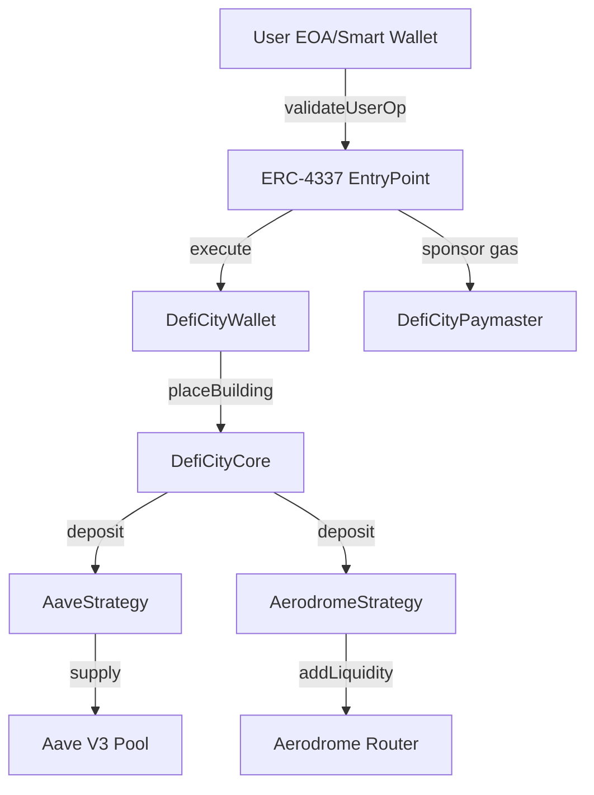

# Smart Contract Design - DefiCity

## Overview

DefiCity is a gamified DeFi portfolio management platform built on Base. This document describes the technical design of the smart contract architecture.

**Version:** 1.0
**Chain:** Base (L2)
**Solidity:** 0.8.24
**Account Abstraction:** ERC-4337

---

## Table of Contents

1. [Architecture Overview](#architecture-overview)
2. [Contract Details](#contract-details)
3. [Data Structures](#data-structures)
4. [Function Flows](#function-flows)
5. [Security Considerations](#security-considerations)
6. [Gas Optimization](#gas-optimization)
7. [Upgrade Strategy](#upgrade-strategy)

---

## Architecture Overview

### High-Level Architecture

```
┌─────────────────────────────────────────────────────────────┐
│                         USER LAYER                          │
│  ┌──────────────┐  ┌──────────────┐  ┌──────────────┐     │
│  │   MetaMask   │  │    Email     │  │   Passkey    │     │
│  └──────┬───────┘  └──────┬───────┘  └──────┬───────┘     │
│         └──────────────────┴──────────────────┘             │
└─────────────────────────┬───────────────────────────────────┘
                          │
                          ▼
┌─────────────────────────────────────────────────────────────┐
│                   ACCOUNT ABSTRACTION                       │
│  ┌─────────────────────────────────────────────────────┐   │
│  │             ERC-4337 EntryPoint                      │   │
│  └──────────────────────┬──────────────────────────────┘   │
│           ┌─────────────┴────────────┐                      │
│           ▼                          ▼                      │
│  ┌───────────────┐         ┌──────────────────┐            │
│  │ DefiCityWallet│         │DefiCityPaymaster │            │
│  │  (User Wallet)│         │ (Gas Sponsor)    │            │
│  └───────┬───────┘         └──────────────────┘            │
└──────────┼──────────────────────────────────────────────────┘
           │
           ▼
┌─────────────────────────────────────────────────────────────┐
│                      GAME LOGIC LAYER                       │
│  ┌─────────────────────────────────────────────────────┐   │
│  │                 DefiCityCore                         │   │
│  │  • Building Management                               │   │
│  │  • Dynamic Building Types                            │   │
│  │  • Fee Collection (0.05%)                            │   │
│  │  • User City State                                   │   │
│  └──────────────────────┬──────────────────────────────┘   │
└─────────────────────────┼───────────────────────────────────┘
                          │
            ┌─────────────┼─────────────┐
            │             │             │
            ▼             ▼             ▼
┌─────────────────────────────────────────────────────────────┐
│                    STRATEGY LAYER                           │
│  ┌──────────┐   ┌────────────────┐   ┌──────────────┐     │
│  │ Town Hall│   │  AaveStrategy  │   │AerodromeStrat│     │
│  │ (Wallet) │   │  (Bank)        │   │ (Shop)       │     │
│  └──────────┘   └────────┬───────┘   └──────┬───────┘     │
└───────────────────────────┼────────────────────┼────────────┘
                            │                    │
                            ▼                    ▼
┌─────────────────────────────────────────────────────────────┐
│                     PROTOCOL LAYER                          │
│  ┌────────────────┐              ┌────────────────┐        │
│  │   Aave V3      │              │   Aerodrome    │        │
│  │   (Base)       │              │   (Base)       │        │
│  │                │              │                │        │
│  │ • Lending      │              │ • LP Providing │        │
│  │ • Borrowing    │              │ • AERO Rewards │        │
│  └────────────────┘              └────────────────┘        │
└─────────────────────────────────────────────────────────────┘
```

### Contract Relationships



---

## Contract Details

### 1. DefiCityCore

**Purpose:** Central game logic contract that manages buildings and coordinates with strategies.

**Key Features:**
- Dynamic building type system (no hardcoded enums)
- Per-building strategy delegation
- Fee collection (0.05% on building creation)
- User city state management
- Level progression system

**State Variables:**

```solidity
// User's city data
mapping(address => UserCity) public cities;

// Building configurations (dynamic)
mapping(uint256 => BuildingConfig) public buildingConfigs;
uint256 public nextBuildingTypeId;

// Fee configuration
uint256 public buildingFee = 5; // 0.05% in BPS
address public treasury;
```

**Critical Functions:**

| Function | Access | Description | Gas Estimate |
|----------|--------|-------------|--------------|
| `placeBuilding()` | External | Create a new building and deposit to strategy | ~200k |
| `deposit()` | External | Add more funds to existing building | ~150k |
| `harvest()` | External | Claim yield from building | ~100k |
| `demolish()` | External | Destroy building and withdraw funds | ~180k |
| `addBuildingType()` | Owner | Add new building type (admin) | ~100k |

**Security Features:**
- ✅ ReentrancyGuard on all state-changing functions
- ✅ SafeERC20 for token transfers
- ✅ Owner-only admin functions
- ✅ Building type validation
- ✅ Minimum deposit checks

---

### 2. AaveStrategy

**Purpose:** Strategy for Bank building - integrates with Aave V3 lending protocol.

**Integration:** Aave V3 on Base

**Assets:**
- Input: USDC
- Receipt: aUSDC (Aave interest-bearing token)

**Key Features:**
- Shares-based accounting (like ERC-4626)
- Auto-compounding yield
- Supply and withdraw from Aave pool
- Real-time APY calculation

**State Variables:**

```solidity
IAavePool public immutable aavePool;
IERC20 public immutable usdc;
IERC20 public immutable aToken;

mapping(address => uint256) public userShares;
mapping(address => uint256) public userDeposits;
uint256 public totalShares;
```

**Functions:**

| Function | Access | Description |
|----------|--------|-------------|
| `deposit()` | Core only | Deposit USDC to Aave |
| `withdraw()` | Core only | Withdraw USDC from Aave |
| `harvest()` | Core only | Calculate earned yield |
| `balanceOf()` | View | Get user's current value |
| `pendingRewards()` | View | Get unclaimed yield |
| `getAPY()` | View | Get current Aave APY |

**Yield Calculation:**

```
Current Value = (userShares × getTotalAssets()) / totalShares
Pending Rewards = Current Value - User's Original Deposit
APY = Aave's current liquidity rate (from Pool)
```

---

### 3. AerodromeStrategy

**Purpose:** Strategy for Shop building - provides liquidity on Aerodrome DEX.

**Integration:** Aerodrome (Base Native DEX)

**Assets:**
- Input: USDC
- Swap: 50% USDC → WETH
- Output: USDC/WETH LP tokens + AERO rewards

**Key Features:**
- Automated LP provisioning (USDC/WETH pair)
- Gauge staking for AERO emissions
- Trading fee collection
- Impermanent loss exposure

**State Variables:**

```solidity
IAerodromeRouter public immutable router;
IAerodromeVoter public immutable voter;
IERC20 public immutable usdc;
IWETH public immutable weth;
IERC20 public immutable aeroToken;

address public pool;    // LP token address
address public gauge;   // Staking gauge
bool public immutable isStable;

mapping(address => uint256) public userShares;
mapping(address => uint256) public userAeroRewards;
```

**Functions:**

| Function | Access | Description |
|----------|--------|-------------|
| `deposit()` | Core only | Swap USDC→WETH, add liquidity, stake |
| `withdraw()` | Core only | Unstake, remove liquidity, swap to USDC |
| `harvest()` | Core only | Claim AERO rewards from gauge |
| `balanceOf()` | View | Get LP value in USDC terms |
| `pendingRewards()` | View | Get unclaimed AERO |
| `updateGauge()` | Owner | Update gauge address if changed |

**Deposit Flow:**

```
1. User deposits 1000 USDC
2. Swap 500 USDC → ~0.25 WETH (via Aerodrome)
3. Add liquidity: 500 USDC + 0.25 WETH → LP tokens
4. Stake LP tokens in Gauge
5. Start earning AERO emissions + trading fees
```

**Withdraw Flow:**

```
1. User withdraws LP shares
2. Unstake from Gauge
3. Remove liquidity: LP → USDC + WETH
4. Swap WETH → USDC
5. Return total USDC to user
```

---

### 4. DefiCityWallet (ERC-4337)

**Purpose:** Smart contract wallet with account abstraction support.

**Key Features:**
- ERC-4337 compliant
- Social login (WebAuthn/Passkeys)
- Session keys for gasless gaming
- Guardian recovery system
- UUPS upgradeable

**State Variables:**

```solidity
IEntryPoint public immutable entryPoint;
address public owner;
address public guardian;
bytes public webAuthnPublicKey;
mapping(address => SessionKey) public sessionKeys;
```

**Authentication Methods:**

1. **Owner Signature** - Traditional ECDSA from owner EOA
2. **Session Keys** - Limited-duration keys with spend limits
3. **WebAuthn** - Passkey authentication (future)
4. **Guardian Recovery** - Backup access via guardian

**Session Key Structure:**

```solidity
struct SessionKey {
    uint256 validUntil;    // Expiration timestamp
    uint256 spendLimit;    // Max spend allowed
    uint256 spent;         // Amount already spent
    bool isActive;         // Is key active?
}
```

---

### 5. DefiCityPaymaster (ERC-4337)

**Purpose:** Sponsors gas fees for approved DefiCity operations.

**Key Features:**
- Pay gas for whitelisted contracts
- Per-user gas limits
- Global budget management
- Verifying signer for operation approval

**State Variables:**

```solidity
IEntryPoint public immutable entryPoint;
address public verifyingSigner;
mapping(address => bool) public allowedTargets;
mapping(address => uint256) public userGasUsed;
mapping(address => uint256) public userGasLimit;
uint256 public defaultUserGasLimit = 0.01 ether;
uint256 public globalGasLimit = 100 ether;
```

**Gas Sponsorship Logic:**

```
1. Check signature from verifyingSigner
2. Verify target contract is allowed (DefiCityCore)
3. Check user hasn't exceeded their gas limit
4. Check global budget not exceeded
5. Sponsor the gas
6. Track usage in postOp callback
```

---

## Data Structures

### UserCity

Represents a player's entire city (portfolio).

```solidity
struct UserCity {
    uint256 totalBuildings;           // Number of buildings placed
    uint256 totalDeposited;            // Total USDC deposited
    uint256 totalEarned;               // Total yield earned
    uint256 level;                     // Player level (1 building = 1/3 level)
    mapping(uint256 => Building) buildings;  // Building data by ID
}
```

### Building

Represents a single building (DeFi position).

```solidity
struct Building {
    uint256 buildingType;      // Type ID (0=Town Hall, 1=Bank, 2=Shop)
    uint256 depositedAmount;   // Original deposit amount
    uint256 shares;            // Strategy shares owned
    uint256 createdAt;         // Creation timestamp
    uint256 lastHarvestAt;     // Last harvest timestamp
    bool isActive;             // Is building active?
}
```

### BuildingConfig

Configuration for a building type (dynamic).

```solidity
struct BuildingConfig {
    string name;               // "Town Hall", "Bank", "Shop"
    IStrategy strategy;        // Strategy contract address
    uint256 minDeposit;        // Minimum deposit (e.g., 100 USDC)
    uint256 maxPerUser;        // Max buildings per user (e.g., 10)
    bool isActive;             // Is this type enabled?
    bool canDemolish;          // Can be demolished?
}
```

---

## Function Flows

### 1. Place Building (with Aave Strategy)

```
User
  │
  │ 1. Approve USDC to DefiCityCore
  ├──────────────────────────────────────────┐
  │                                          │
  │ 2. placeBuilding(1, 1000 USDC)          │
  └──────────────▶ DefiCityCore             │
                   │                         │
                   │ 3. Transfer 1000 USDC  │
                   │    from user            │
                   │                         │
                   │ 4. Deduct 0.05% fee     │
                   │    (0.5 USDC → treasury)│
                   │                         │
                   │ 5. deposit(999.5 USDC)  │
                   └──────────▶ AaveStrategy │
                                │            │
                                │ 6. Approve USDC to Aave
                                │            │
                                │ 7. supply()│
                                └──────────▶ Aave Pool
                                             │
                                             │ 8. Mint aUSDC
                                             │    to strategy
                                             │
                   ◀─────────────────────────┘
                   │ 9. Update shares
                   │
  ◀────────────────┘ 10. Emit BuildingPlaced
```

### 2. Harvest Yield

```
User
  │
  │ harvest(buildingId)
  └──────────▶ DefiCityCore
               │
               │ harvest()
               └──────────▶ AaveStrategy
                            │
                            │ 1. Calculate pending rewards
                            │    currentValue = (shares × totalAssets) / totalShares
                            │    yield = currentValue - userDeposits
                            │
                            │ 2. No actual withdrawal (auto-compounding)
                            │
               ◀────────────┘
               │ 3. Update totalEarned
               │
  ◀────────────┘ 4. Emit BuildingHarvest
```

### 3. Demolish Building

```
User
  │
  │ demolish(buildingId)
  └──────────▶ DefiCityCore
               │
               │ withdraw(shares)
               └──────────▶ AaveStrategy
                            │
                            │ 1. Calculate withdrawal amount
                            │
                            │ 2. withdraw()
                            └──────────▶ Aave Pool
                                         │
                                         │ 3. Burn aUSDC
                                         │ 4. Send USDC to strategy
                                         │
                            ◀────────────┘
                            │ 5. Send USDC to core
                            │
               ◀────────────┘
               │ 6. Deactivate building
               │
  ◀────────────┘ 7. Emit BuildingDemolished
```

### 4. Gasless Transaction (ERC-4337)

```
User (via dApp)
  │
  │ 1. Sign UserOperation (off-chain)
  └──────────▶ Bundler
               │
               │ 2. handleOps()
               └──────────▶ EntryPoint
                            │
                            │ 3. validatePaymasterUserOp()
                            ├──────────▶ DefiCityPaymaster
                            │            │
                            │            │ 4. Verify signature
                            │            │ 5. Check gas limits
                            │            │
                            │◀───────────┘ 6. Return: sponsor = true
                            │
                            │ 7. validateUserOp()
                            ├──────────▶ DefiCityWallet
                            │            │
                            │            │ 8. Verify user signature
                            │            │
                            │◀───────────┘ 9. Return: valid
                            │
                            │ 10. execute()
                            ├──────────▶ DefiCityWallet
                            │            │
                            │            │ 11. call()
                            │            └──────────▶ DefiCityCore
                            │                         │
                            │                         │ 12. Execute game logic
                            │                         │
                            │            ◀────────────┘
                            │◀───────────┘
                            │
                            │ 13. postOp()
                            └──────────▶ DefiCityPaymaster
                                         │
                                         │ 14. Track gas usage
                                         │
               ◀─────────────────────────┘
```

---

## Security Considerations

### Access Control

| Contract | Critical Functions | Protection |
|----------|-------------------|------------|
| DefiCityCore | `addBuildingType()`, `setBuildingFee()` | `onlyOwner` |
| AaveStrategy | `setDefiCityCore()` | `onlyOwner` |
| AerodromeStrategy | `setDefiCityCore()`, `emergencyWithdraw()` | `onlyOwner` |
| DefiCityWallet | `changeOwner()` | `guardian` only |
| DefiCityPaymaster | All admin functions | `onlyOwner` |

### Reentrancy Protection

All state-changing functions in `DefiCityCore` use `nonReentrant` modifier:
- ✅ `placeBuilding()`
- ✅ `deposit()`
- ✅ `harvest()`
- ✅ `demolish()`

### Input Validation

```solidity
// Example validations
require(amount > 0, "Zero amount");
require(buildingType < nextBuildingTypeId, "Invalid building type");
require(initialDeposit >= config.minDeposit, "Below minimum");
require(currentCount < config.maxPerUser, "Max buildings reached");
```

### Token Safety

- ✅ Use `SafeERC20` for all token operations
- ✅ Check token balances before and after transfers
- ✅ Approve exact amounts to external protocols
- ✅ No token approvals remain after operations

### Strategy Isolation

Each strategy is isolated:
- Can only be called by `DefiCityCore`
- Uses `tx.origin` to track actual user
- Cannot interact with other strategies
- Owner can set core address only once

### Emergency Mechanisms

```solidity
// AerodromeStrategy: Emergency withdrawal
function emergencyWithdraw() external onlyOwner {
    // Unstake from gauge
    // Transfer all assets to owner
    // FOR EMERGENCY USE ONLY
}
```

### Known Risks

| Risk | Mitigation | Severity |
|------|------------|----------|
| Impermanent Loss (Aerodrome) | Clearly communicated to users | Medium |
| Smart Contract Risk | Audit + tested protocols | Medium |
| Oracle Dependency | Uses on-chain price (Aerodrome reserves) | Low |
| Centralization (Owner) | Timelock planned for v2 | Medium |

---

## Gas Optimization

### Strategies Used

1. **Packed Storage**
   ```solidity
   // Efficient packing in Building struct
   struct Building {
       uint256 buildingType;    // slot 0
       uint256 depositedAmount; // slot 1
       uint256 shares;          // slot 2
       uint256 createdAt;       // slot 3
       uint256 lastHarvestAt;   // slot 4
       bool isActive;           // slot 5 (only uses 1 byte)
   }
   ```

2. **Immutable Variables**
   ```solidity
   IAavePool public immutable aavePool;    // Saves ~2100 gas per read
   IERC20 public immutable usdc;
   ```

3. **Unchecked Arithmetic** (where safe)
   ```solidity
   unchecked {
       ++i;  // Saves ~80 gas per iteration
   }
   ```

4. **Custom Errors**
   ```solidity
   error ZeroAmount();        // Cheaper than require strings
   error InsufficientShares();
   ```

5. **Via IR Compilation**
   - Enabled in foundry.toml: `via_ir = true`
   - Better optimization for complex contracts

### Gas Estimates

| Operation | Gas Cost | Notes |
|-----------|----------|-------|
| Place Bank (Aave) | ~200k | Including USDC transfers + Aave supply |
| Place Shop (Aerodrome) | ~400k | Swap + LP + Gauge staking |
| Harvest (Aave) | ~100k | View-only calculation |
| Harvest (Aerodrome) | ~150k | Claim AERO from gauge |
| Demolish | ~180k | Withdraw + cleanup |
| Gasless TX overhead | ~50k | ERC-4337 validation |

---

## Upgrade Strategy

### Current Status: Non-Upgradeable (v1)

**Contracts:**
- ❌ DefiCityCore - Not upgradeable
- ❌ AaveStrategy - Not upgradeable
- ❌ AerodromeStrategy - Not upgradeable
- ✅ DefiCityWallet - UUPS upgradeable
- ❌ DefiCityPaymaster - Not upgradeable

**Rationale:**
- Phase 1 prioritizes simplicity and security
- Immutable = more trustless for users
- Only wallet needs upgrade for new features

### Future: Proxy Pattern (v2)

**Planned for Phase 2:**

1. **TransparentProxy for Core**
   ```
   User → TransparentProxy → DefiCityCore (Logic)
   ```

2. **Strategy Registry**
   ```solidity
   contract StrategyRegistry {
       mapping(uint256 => address) public strategies;

       function updateStrategy(uint256 buildingType, address newStrategy)
           external onlyOwner {
           strategies[buildingType] = newStrategy;
       }
   }
   ```

3. **Timelock Governance**
   ```
   Owner → Timelock (48h) → Core/Strategies
   ```

### Migration Plan (if needed)

```
1. Deploy new contract versions
2. Pause old contracts
3. Allow users to withdraw
4. Redirect to new contracts
5. Migrate any protocol-level state
```

---

## Testing Strategy

### Unit Tests

```bash
forge test -vv
```

**Coverage:**
- ✅ DefiCityCore: All functions
- ✅ AaveStrategy: Deposit, withdraw, harvest
- ✅ AerodromeStrategy: LP operations, rewards
- ✅ Access control
- ✅ Edge cases (zero amounts, max limits)

### Integration Tests

```bash
forge test --fork-url $BASE_RPC_URL -vvv
```

**Scenarios:**
- ✅ End-to-end user flow
- ✅ Multi-building portfolio
- ✅ Strategy interactions
- ✅ ERC-4337 gasless flow

### Mainnet Fork Tests

```solidity
// Test against real Aave and Aerodrome on Base
function testFork_AaveDeposit() public {
    vm.selectFork(baseFork);
    // Test with actual protocol
}
```

---

## Deployment Checklist

### Pre-Deployment

- [ ] All tests passing
- [ ] Gas optimization review
- [ ] Security audit completed
- [ ] Multisig setup for owner
- [ ] Testnet deployment tested

### Deployment Steps

```bash
# 1. Deploy on Base Sepolia
forge script script/Deploy.s.sol --rpc-url $BASE_SEPOLIA_RPC_URL --broadcast

# 2. Verify contracts
forge verify-contract <address> DefiCityCore --chain base-sepolia

# 3. Test on testnet
# 4. Deploy on Base Mainnet
forge script script/Deploy.s.sol --rpc-url $BASE_RPC_URL --broadcast
```

### Post-Deployment

- [ ] Verify all contracts on Basescan
- [ ] Fund Paymaster with ETH
- [ ] Configure building types
- [ ] Set treasury address
- [ ] Test with real transactions
- [ ] Monitor for 48 hours

---

## Appendix

### Contract Addresses (Testnet)

```
# Base Sepolia
DefiCityCore: TBD
AaveStrategy: TBD
AerodromeStrategy: TBD
DefiCityWallet (impl): TBD
DefiCityPaymaster: TBD
```

### Contract Addresses (Mainnet)

```
# Base Mainnet
DefiCityCore: TBD
AaveStrategy: TBD
AerodromeStrategy: TBD
DefiCityWallet (impl): TBD
DefiCityPaymaster: TBD
```

### External Dependencies

| Protocol | Address | Version |
|----------|---------|---------|
| Aave Pool | `0xA238Dd80C259a72e81d7e4664a9801593F98d1c5` | V3 |
| USDC | `0x833589fCD6eDb6E08f4c7C32D4f71b54bdA02913` | - |
| aUSDC | `0x4e65fE4DbA92790696d040ac24Aa414708F5c0AB` | V3 |
| Aerodrome Router | `0xcF77a3Ba9A5CA399B7c97c74d54e5b1Beb874E43` | - |
| Aerodrome Voter | `0x16613524e02ad97eDfeF371bC883F2F5d6C480A5` | - |
| AERO Token | `0x940181a94A35A4569E4529A3CDfB74e38FD98631` | - |
| WETH | `0x4200000000000000000000000000000000000006` | - |
| EntryPoint | `0x5FF137D4b0FDCD49DcA30c7CF57E578a026d2789` | v0.6 |

---

**Last Updated:** 2025-01-14
**Author:** DefiCity Team
**License:** MIT
