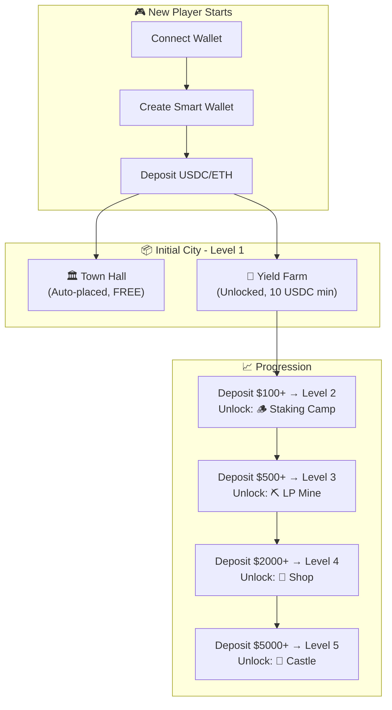
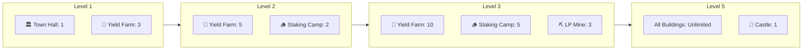
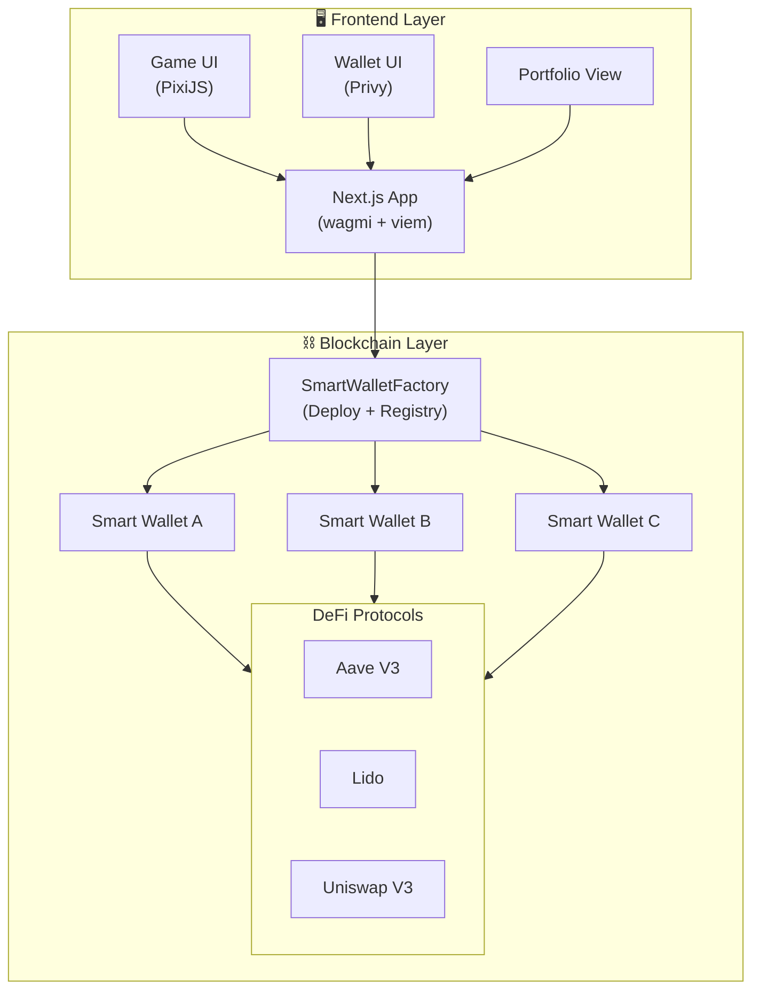
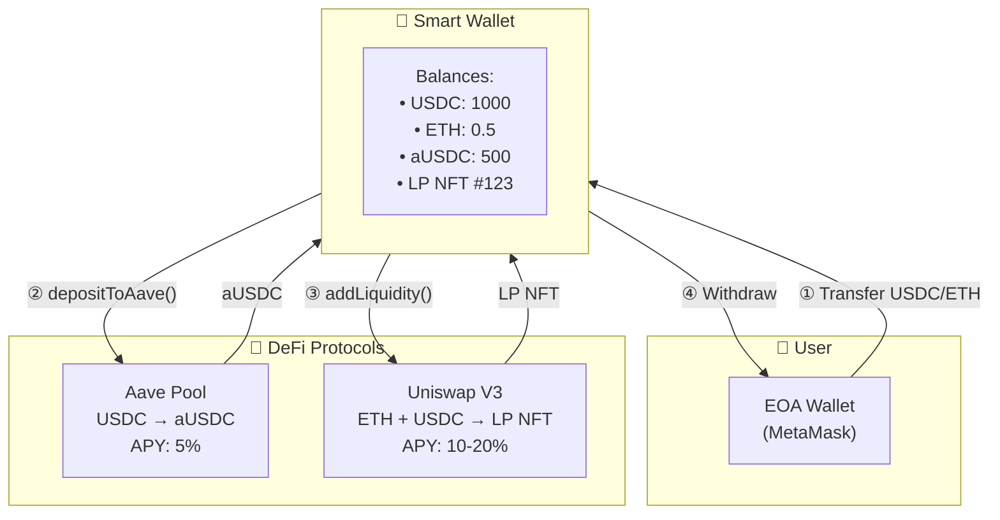
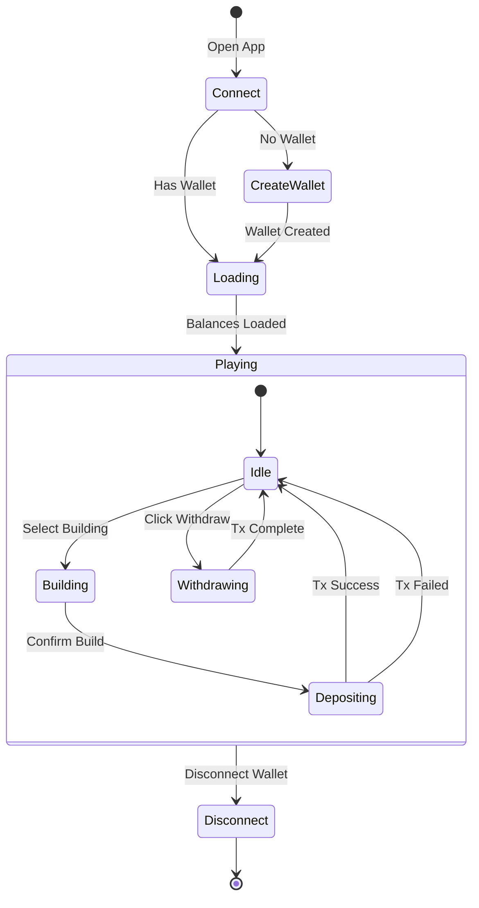
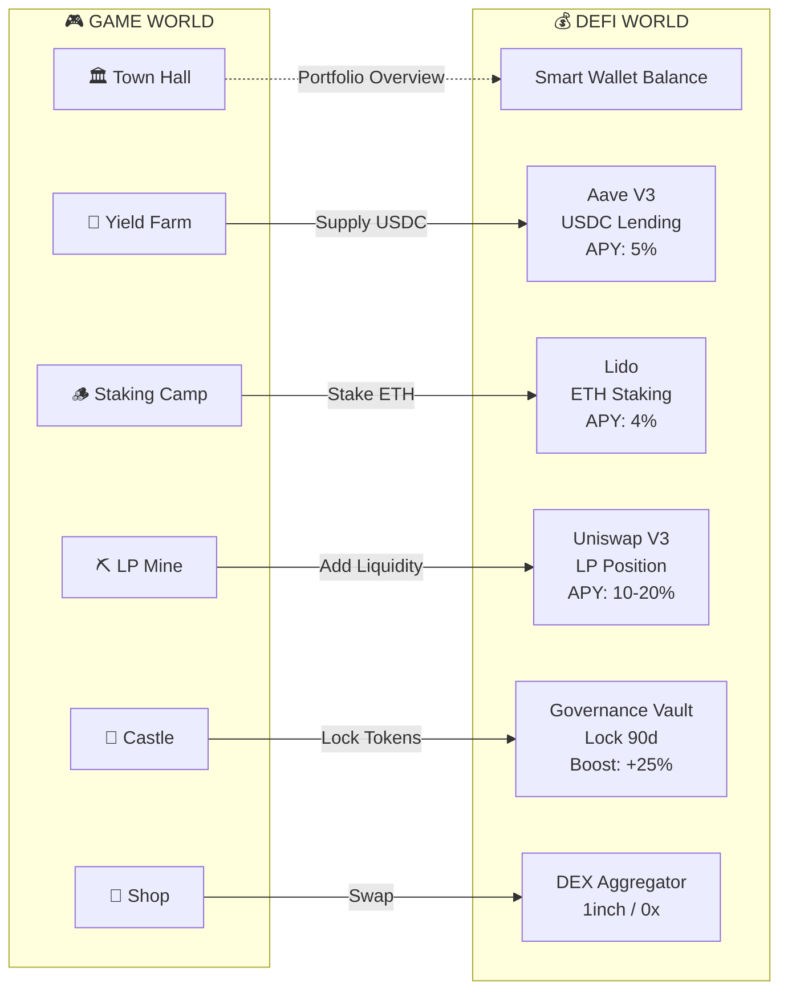
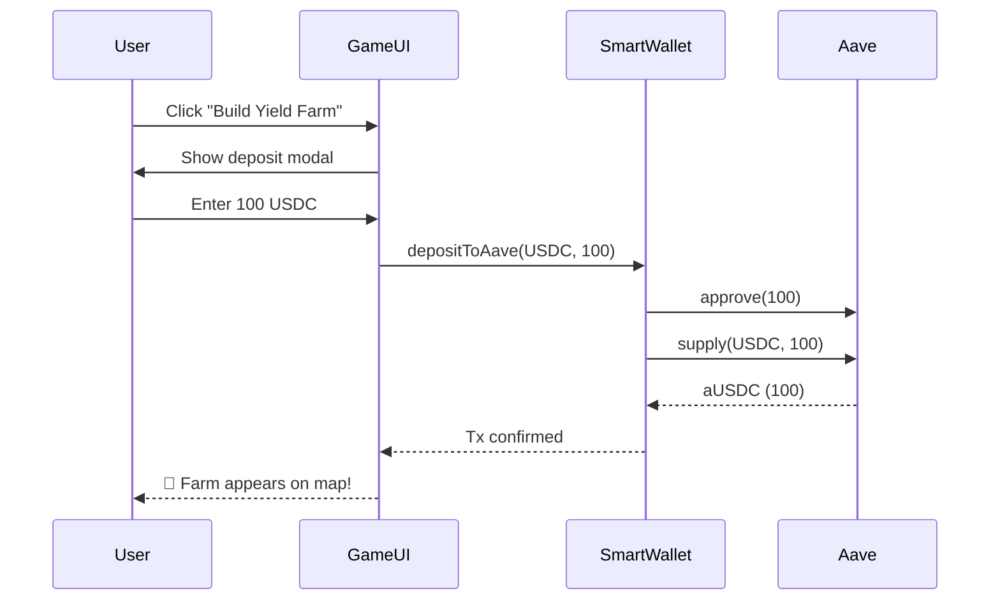
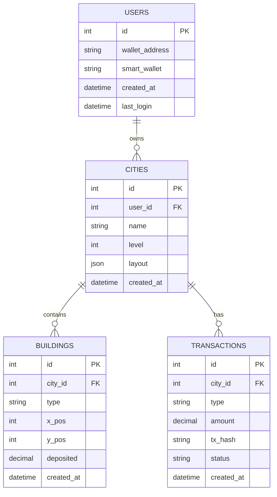
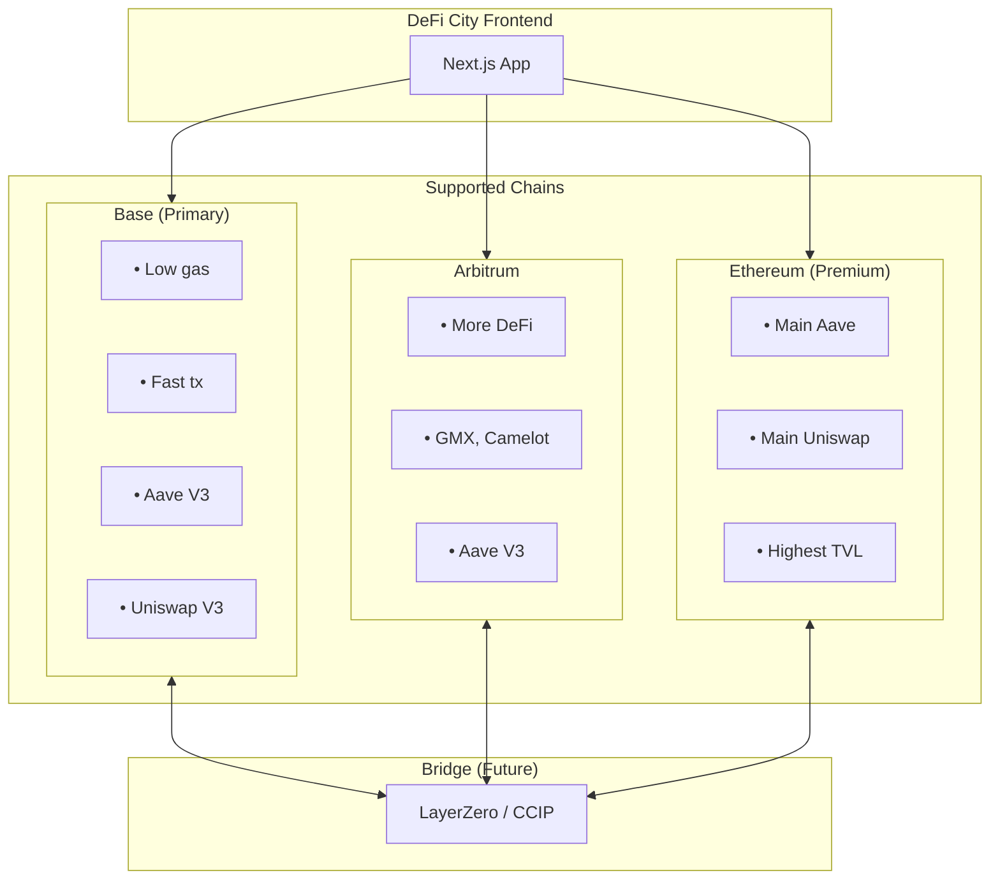
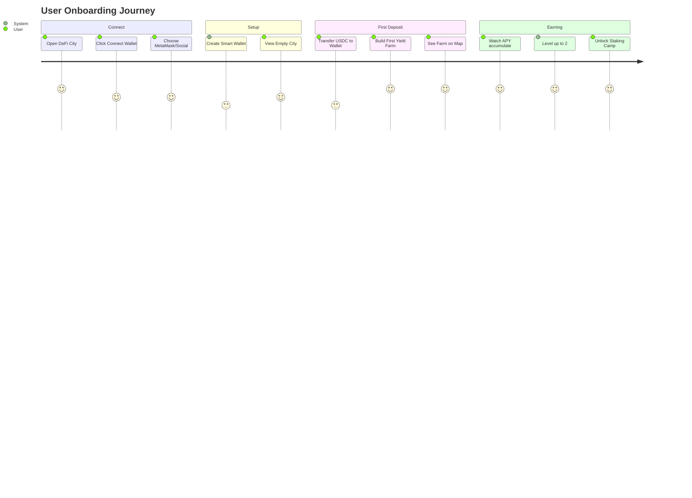

# DeFi City Builder - Product Requirements Document

## Overview

**DeFi City** เป็นเกม City Builder ที่ทำให้การบริหารเงินบน DeFi เป็นเรื่องง่ายและสนุก โดยแปลง DeFi concepts ให้เป็น game mechanics ที่เข้าใจง่าย

### Core Concept

| Game Concept         | DeFi Reality        |
| -------------------- | ------------------- |
| เมือง (City)         | Portfolio ของผู้ใช้ |
| อาคาร (Buildings)    | DeFi Strategies     |
| ทรัพยากร (Resources) | Real Crypto Assets  |
| เล่นเกม              | บริหารเงินบน DeFi   |

---

## Target Users

- **Web3 Beginners**: ผู้ที่สนใจ DeFi แต่ไม่รู้จะเริ่มต้นยังไง
- **Passive Investors**: ต้องการ yield โดยไม่ต้องเรียนรู้ DeFi protocols ที่ซับซ้อน
- **Gamers**: ชอบเกม City Builder และต้องการ earn real crypto

---

## User Flow

### Step 1: Connect Wallet

```
┌─────────────────────────────────────────────────────────┐
│                    🎮 DeFi City                         │
│                                                         │
│              Welcome to DeFi City!                      │
│                                                         │
│         ┌─────────────────────────────┐                │
│         │   🦊 Connect with MetaMask  │                │
│         └─────────────────────────────┘                │
│         ┌─────────────────────────────┐                │
│         │   📧 Connect with Email     │                │
│         └─────────────────────────────┘                │
│         ┌─────────────────────────────┐                │
│         │   🔑 Connect with Google    │                │
│         └─────────────────────────────┘                │
│                                                         │
└─────────────────────────────────────────────────────────┘
```

**Technical:**

- ใช้ Privy/Dynamic SDK สำหรับ authentication
- รองรับ EOA (MetaMask) และ Social Login
- เก็บ session ใน localStorage

### Step 2: Create Smart Wallet (ถ้ายังไม่มี)

```
┌─────────────────────────────────────────────────────────┐
│                                                         │
│         🏗️ Creating Your Smart Wallet...               │
│                                                         │
│         ┌─────────────────────────────┐                │
│         │  ████████████░░░░  75%      │                │
│         └─────────────────────────────┘                │
│                                                         │
│         ✅ Deploying wallet contract                   │
│         ✅ Setting up permissions                       │
│         ⏳ Finalizing...                               │
│                                                         │
│         Your wallet: 0x1234...5678                     │
│                                                         │
└─────────────────────────────────────────────────────────┘
```

**Technical:**

```javascript
// Check if user has Smart Wallet
const existingWallet = await factory.getWallet(userAddress);

if (existingWallet === ADDRESS_ZERO) {
  // Create new Smart Wallet
  const tx = await factory.createWallet(userAddress);
  await tx.wait();

  // Get new wallet address
  const newWallet = await factory.getWallet(userAddress);
  console.log("Smart Wallet created:", newWallet);
}
```

**Flow:**

```
User connects EOA (MetaMask/Social)
         │
         ▼
Check SmartWalletFactory.getWallet(user)
         │
         ├── Wallet exists? → Go to Step 3
         │
         └── No wallet? → Deploy new SmartWallet
                              │
                              ▼
                         Save to localStorage
                              │
                              ▼
                         Go to Step 3
```

### Step 3: Start Playing DeFi (Game HTML)

```
┌─────────────────────────────────────────────────────────┐
│  💰 2500    ◇ 1.50    💎 500           🔗 Connected    │
├─────────────────────────────────────────────────────────┤
│                                                         │
│     ⬆️                        🌲         🌲            │
│   ⬅️ 🧍 ➡️         🏛️                                  │
│     ⬇️          Town Hall      🌲     🌲               │
│                                                         │
│        🌾              ⛏️                               │
│    Yield Farm       LP Mine          🌲                │
│                                                         │
├─────────────────────────────────────────────────────────┤
│  [🏛️ Town Hall] [🌾 Farm] [⛏️ Mine] [🏪 Shop] [🏰]    │
└─────────────────────────────────────────────────────────┘
```

**User Actions in Game:**

| Game Action      | Smart Contract Call                     | Result              |
| ---------------- | --------------------------------------- | ------------------- |
| สร้าง Yield Farm | `wallet.depositToAave(USDC, 100)`       | ได้ aUSDC           |
| สร้าง LP Mine    | `wallet.addLiquidity(ETH, USDC, ...)`   | ได้ LP NFT          |
| เก็บ Yield       | `wallet.withdrawFromAave(USDC, amount)` | ได้ USDC + interest |
| Collect Fees     | `wallet.collectFees(tokenId)`           | ได้ trading fees    |

**Complete User Journey:**

```
┌────────────────────────────────────────────────────────────────┐
│                                                                │
│   ┌──────────┐    ┌──────────────┐    ┌──────────────────┐   │
│   │  Step 1  │    │    Step 2    │    │      Step 3      │   │
│   │ Connect  │───▶│ Create Smart │───▶│   Play Game      │   │
│   │ Wallet   │    │   Wallet     │    │   (DeFi)         │   │
│   └──────────┘    └──────────────┘    └──────────────────┘   │
│        │                 │                     │              │
│        ▼                 ▼                     ▼              │
│   ┌──────────┐    ┌──────────────┐    ┌──────────────────┐   │
│   │ MetaMask │    │SmartWallet   │    │ • Build farms    │   │
│   │ or       │    │Factory       │    │ • Deposit crypto │   │
│   │ Social   │    │.createWallet()│   │ • Earn yields    │   │
│   │ Login    │    │              │    │ • Withdraw profit│   │
│   └──────────┘    └──────────────┘    └──────────────────┘   │
│                                                                │
└────────────────────────────────────────────────────────────────┘
```

### Deposit & Withdraw Flow

**Deposit (เติมเงินเข้าเกม):**

```
User's MetaMask/CEX
        │
        │ Transfer USDC/ETH
        ▼
┌─────────────────┐
│  Smart Wallet   │  ← User's game wallet
│  (0x1234...)    │
└────────┬────────┘
         │
         │ สร้างอาคาร = Deposit to Protocol
         ▼
┌─────────────────┐
│  Aave/Uniswap   │
│  (get aUSDC/LP) │
└─────────────────┘
```

**Withdraw (ถอนเงินออก):**

```
Game: Click "Withdraw" on building
        │
        ▼
SmartWallet.withdrawFromAave() / removeLiquidity()
        │
        ▼
┌─────────────────┐
│  Smart Wallet   │  ← USDC/ETH returned here
│  (0x1234...)    │
└────────┬────────┘
         │
         │ User clicks "Send to MetaMask"
         ▼
┌─────────────────┐
│  User's EOA     │
│  or CEX address │
└─────────────────┘
```

---

## Core Features

### 1. Smart Wallet System

#### 1.1 Wallet Creation

- ใช้ **Account Abstraction (ERC-4337)** สร้าง Smart Wallet
- Social Login (Google, Apple, Email) - ไม่ต้องจำ seed phrase
- Gasless transactions (Paymaster sponsored)

#### 1.2 Deposit Flow

```
User → Deposit USDC/ETH → Smart Wallet → Game Portfolio
```

#### 1.3 Withdrawal Flow

```
Game Portfolio → Smart Wallet → User's EOA/CEX
```

---

### 2. Building Types (DeFi Strategies)

#### 2.1 Yield Farm (Aave Integration)

| Attribute    | Value               |
| ------------ | ------------------- |
| Strategy     | USDC → Aave Lending |
| Expected APY | 3-8%                |
| Risk Level   | Low                 |
| Min Deposit  | 10 USDC             |

**Smart Contract Flow:**

```solidity
// Deposit
USDC.approve(aavePool, amount);
aavePool.supply(USDC, amount, smartWallet, 0);

// Withdraw
aavePool.withdraw(USDC, amount, smartWallet);
```

#### 2.2 Staking Camp (Lido/Rocket Pool)

| Attribute    | Value            |
| ------------ | ---------------- |
| Strategy     | ETH → stETH/rETH |
| Expected APY | 3-5%             |
| Risk Level   | Low-Medium       |
| Min Deposit  | 0.01 ETH         |

#### 2.3 LP Mine (Uniswap Integration)

| Attribute    | Value                     |
| ------------ | ------------------------- |
| Strategy     | ETH-USDC LP on Uniswap V3 |
| Expected APY | 5-20% (variable)          |
| Risk Level   | Medium-High               |
| Min Deposit  | 50 USDC equivalent        |

**Smart Contract Flow:**

```solidity
// Add Liquidity
uniswapRouter.addLiquidity(
    tokenA, tokenB,
    amountA, amountB,
    minA, minB,
    smartWallet,
    deadline
);

// Remove Liquidity
uniswapRouter.removeLiquidity(...);
```

#### 2.4 Castle (Governance Vault)

| Attribute   | Value                                |
| ----------- | ------------------------------------ |
| Strategy    | veToken Locking (e.g., veCRV, veBAL) |
| Boost       | +25% yields on other buildings       |
| Lock Period | 90 days                              |
| Min Deposit | 1000 USDC equivalent                 |

#### 2.5 Shop (DEX Aggregator)

| Attribute    | Value                      |
| ------------ | -------------------------- |
| Strategy     | Swap fees rebate           |
| Expected APY | Variable (based on volume) |
| Risk Level   | Low                        |

---

### 3. Resource System

#### 3.1 In-Game Resources

| Resource   | Real Asset | Usage              |
| ---------- | ---------- | ------------------ |
| Gold Coins | USDC/USDT  | Build, upgrade     |
| Ethereum   | ETH        | Premium buildings  |
| LP Tokens  | Uniswap LP | Special structures |

#### 3.2 Resource Generation

- Buildings generate resources based on **real DeFi yields**
- UI shows both game value and real USD value
- Auto-compound option available

---

### 4. Game Mechanics

#### 4.1 City Progression

```
Level 1: Town Hall + 3 Yield Farms
Level 2: Unlock Staking Camp
Level 3: Unlock LP Mine
Level 4: Unlock Castle
Level 5: Unlock Advanced Strategies
```

#### 4.2 Risk Management

- **Walls**: Insurance protocols (Nexus Mutual)
- **Guard Towers**: Stop-loss automation
- **Moat**: Diversification bonus

#### 4.3 Social Features

- Visit friends' cities
- Guild system (shared vaults)
- Leaderboards (by TVL, APY, city level)

---

## Building Progression (Starting Buildings)

### Initial Buildings by Level

| Level | TVL Required | Unlocked Buildings  | Protocol        |
| ----- | ------------ | ------------------- | --------------- |
| 1     | $0           | 🏛️ Town Hall (auto) | -               |
| 1     | $0           | 🌾 Yield Farm       | Aave (USDC)     |
| 2     | $100         | 🪵 Staking Camp     | Lido (ETH)      |
| 3     | $500         | ⛏️ LP Mine          | Uniswap V3      |
| 4     | $2,000       | 🏪 Shop             | DEX Aggregator  |
| 5     | $5,000       | 🏰 Castle           | Governance Lock |

### Starting State (New Player)



### Building Limits per Level



---

## System Diagrams (Mermaid)

### Overall System Architecture



### Token Flow Diagram



### Game State Machine



### Building → Protocol Mapping



### Sequence: Build Yield Farm



### Database Schema (Off-chain)



### Multi-Chain Architecture (Future)



### User Onboarding Flow



---

## Technical Architecture

### 5.1 Smart Contract Stack

```
┌──────────────────────────────────────────────────────────┐
│                     DeFi City Protocol                   │
├──────────────────────────────────────────────────────────┤
│                                                          │
│   User A              User B              User C         │
│      │                   │                   │           │
│      ▼                   ▼                   ▼           │
│  ┌────────┐         ┌────────┐         ┌────────┐       │
│  │ Smart  │         │ Smart  │         │ Smart  │       │
│  │Wallet A│         │Wallet B│         │Wallet C│       │
│  ├────────┤         ├────────┤         ├────────┤       │
│  │• aUSDC │         │• aUSDC │         │• stETH │       │
│  │• stETH │         │• LP NFT│         │• aUSDC │       │
│  │• USDC  │         │• ETH   │         │• LP NFT│       │
│  └────┬───┘         └────┬───┘         └────┬───┘       │
│       │                  │                  │            │
│       └──────────────────┼──────────────────┘            │
│                          ▼                               │
│  ┌───────────────────────────────────────────────┐      │
│  │           SmartWalletFactory                   │      │
│  │  (Deploy Smart Wallets + Registry)             │      │
│  └───────────────────────────────────────────────┘      │
│                          │                               │
│       ┌──────────────────┼──────────────────┐           │
│       ▼                  ▼                  ▼           │
│  ┌─────────┐       ┌──────────┐       ┌─────────┐      │
│  │  Aave   │       │ Uniswap  │       │  Lido   │      │
│  │  Pool   │       │   V3     │       │         │      │
│  └─────────┘       └──────────┘       └─────────┘      │
└──────────────────────────────────────────────────────────┘
```

**Key Points:**

- แต่ละ User มี Smart Wallet ของตัวเอง
- Assets (aUSDC, stETH, LP NFT) เก็บใน Smart Wallet โดยตรง
- ไม่มี VaultManager - User เป็นเจ้าของ 100%
- SmartWalletFactory ใช้ deploy wallet ใหม่เท่านั้น

### 5.2 Key Contracts

#### SmartWalletFactory.sol

```solidity
contract SmartWalletFactory {
    mapping(address => address) public wallets; // owner => wallet

    event WalletCreated(address indexed owner, address indexed wallet);

    function createWallet(address owner) external returns (address) {
        SmartWallet wallet = new SmartWallet(owner, entryPoint);
        wallets[owner] = address(wallet);
        emit WalletCreated(owner, address(wallet));
        return address(wallet);
    }

    function getWallet(address owner) external view returns (address) {
        return wallets[owner];
    }
}
```

#### SmartWallet.sol

```solidity
contract SmartWallet is ERC4337Account {
    address public owner;
    IPool public constant AAVE_POOL = IPool(0x...);
    ISwapRouter public constant UNISWAP_ROUTER = ISwapRouter(0x...);

    // ============ Aave Functions ============

    function depositToAave(address token, uint256 amount) external onlyOwner {
        IERC20(token).approve(address(AAVE_POOL), amount);
        AAVE_POOL.supply(token, amount, address(this), 0);
        // aToken is sent directly to this wallet
    }

    function withdrawFromAave(address token, uint256 amount) external onlyOwner {
        AAVE_POOL.withdraw(token, amount, address(this));
    }

    function getAaveBalance(address aToken) external view returns (uint256) {
        return IERC20(aToken).balanceOf(address(this));
    }

    // ============ Uniswap Functions ============

    function addLiquidity(
        address token0,
        address token1,
        uint256 amount0,
        uint256 amount1,
        int24 tickLower,
        int24 tickUpper
    ) external onlyOwner returns (uint256 tokenId) {
        // Approve tokens
        IERC20(token0).approve(address(positionManager), amount0);
        IERC20(token1).approve(address(positionManager), amount1);

        // Mint LP position - NFT sent to this wallet
        (tokenId,,,) = positionManager.mint(MintParams({
            token0: token0,
            token1: token1,
            fee: 3000,
            tickLower: tickLower,
            tickUpper: tickUpper,
            amount0Desired: amount0,
            amount1Desired: amount1,
            amount0Min: 0,
            amount1Min: 0,
            recipient: address(this),
            deadline: block.timestamp
        }));
    }

    function removeLiquidity(uint256 tokenId) external onlyOwner {
        // Decrease liquidity and collect tokens back to wallet
        positionManager.decreaseLiquidity(...);
        positionManager.collect(...);
    }

    function collectFees(uint256 tokenId) external onlyOwner {
        positionManager.collect(CollectParams({
            tokenId: tokenId,
            recipient: address(this),
            amount0Max: type(uint128).max,
            amount1Max: type(uint128).max
        }));
    }

    // ============ Generic Execute ============

    function execute(
        address target,
        uint256 value,
        bytes calldata data
    ) external onlyOwner returns (bytes memory) {
        (bool success, bytes memory result) = target.call{value: value}(data);
        require(success, "Execution failed");
        return result;
    }
}
```

#### GameRegistry.sol (Optional - for leaderboards/social)

```solidity
contract GameRegistry {
    struct CityStats {
        uint256 level;
        uint256 totalDeposited;
        uint256 buildingCount;
        uint256 lastUpdate;
    }

    mapping(address => CityStats) public cities;

    // Called by frontend to update stats (optional, for social features)
    function updateStats(address wallet, CityStats calldata stats) external {
        // Verify caller owns the wallet
        require(SmartWallet(wallet).owner() == msg.sender, "Not owner");
        cities[wallet] = stats;
    }

    function getLeaderboard() external view returns (address[] memory, uint256[] memory) {
        // Return top cities by TVL
    }
}

### 5.3 Frontend Stack

```

┌────────────────────────────────────────┐
│ DeFi City Frontend │
├────────────────────────────────────────┤
│ Next.js 14 (App Router) │
│ ├── PixiJS (Game Rendering) │
│ ├── wagmi + viem (Web3) │
│ ├── Privy/Dynamic (Smart Wallet) │
│ └── TanStack Query (Data Fetching) │
└────────────────────────────────────────┘

```

---

## Integrations

### 6.1 Aave V3 (Primary Lending)
- **Networks**: Ethereum, Arbitrum, Base
- **Assets**: USDC, USDT, DAI, ETH, WBTC
- **Features**: Supply, Borrow, Flash Loans

### 6.2 Uniswap V3 (Primary DEX)
- **Networks**: Ethereum, Arbitrum, Base, Polygon
- **Features**:
  - Concentrated Liquidity Positions
  - Auto-rebalancing ranges
  - Fee tier optimization (0.05%, 0.3%, 1%)

### 6.3 Future Integrations
- **Lido**: ETH Liquid Staking
- **Curve**: Stablecoin pools
- **Compound**: Additional lending
- **GMX**: Perpetual trading strategies
- **Yearn**: Vault strategies

---

## Security

### 7.1 Smart Contract Security
- [ ] Multiple audits (Certik, Trail of Bits)
- [ ] Formal verification for core contracts
- [ ] Time-locked upgrades (48h delay)
- [ ] Emergency pause functionality
- [ ] Rate limiting on withdrawals

### 7.2 User Security
- [ ] 2FA for large withdrawals
- [ ] Spending limits
- [ ] Whitelist addresses
- [ ] Session keys with expiration

---

## Roadmap

### Phase 1: MVP (Q1 2025)
- [ ] Smart Wallet creation
- [ ] Basic city UI (isometric view)
- [ ] Aave integration (USDC lending)
- [ ] Single building type (Yield Farm)
- [ ] Testnet deployment (Base Sepolia)

### Phase 2: Core Game (Q2 2025)
- [ ] Uniswap LP integration
- [ ] Multiple building types
- [ ] City progression system
- [ ] Mainnet deployment (Base)

### Phase 3: Social (Q3 2025)
- [ ] Friend system
- [ ] City visiting
- [ ] Guild/DAO features
- [ ] Leaderboards

### Phase 4: Advanced (Q4 2025)
- [ ] Cross-chain cities
- [ ] Advanced strategies
- [ ] Mobile app
- [ ] SDK for third-party strategies

---

## Metrics & KPIs

| Metric | Target (6 months) |
|--------|-------------------|
| Total Users | 10,000 |
| TVL | $5M |
| Daily Active Users | 2,000 |
| Average Portfolio Size | $500 |
| User Retention (30d) | 40% |

---

## Revenue Model

1. **Performance Fee**: 10% of profits generated
2. **Premium Features**: Advanced buildings, analytics
3. **NFT Buildings**: Limited edition structures
4. **Protocol Partnerships**: Referral fees from integrated protocols

---

## Team Requirements

- Smart Contract Engineers (2)
- Frontend/Game Developers (2)
- Product Designer (1)
- Security Engineer (1)
- Community Manager (1)

---

## Appendix

### A. Glossary
- **TVL**: Total Value Locked
- **APY**: Annual Percentage Yield
- **LP**: Liquidity Provider
- **Smart Wallet**: ERC-4337 Account Abstraction wallet

### B. References
- [Aave V3 Documentation](https://docs.aave.com/)
- [Uniswap V3 Documentation](https://docs.uniswap.org/)
- [ERC-4337 Specification](https://eips.ethereum.org/EIPS/eip-4337)
- [Privy Documentation](https://docs.privy.io/)

---

*Last Updated: January 2025*
*Version: 1.0*
```
